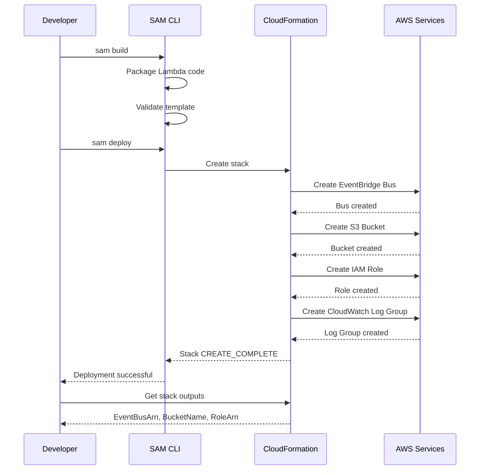
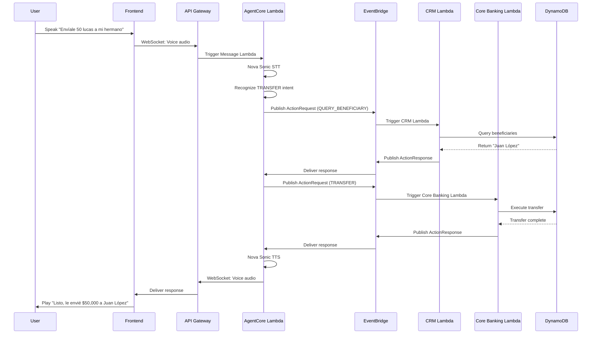
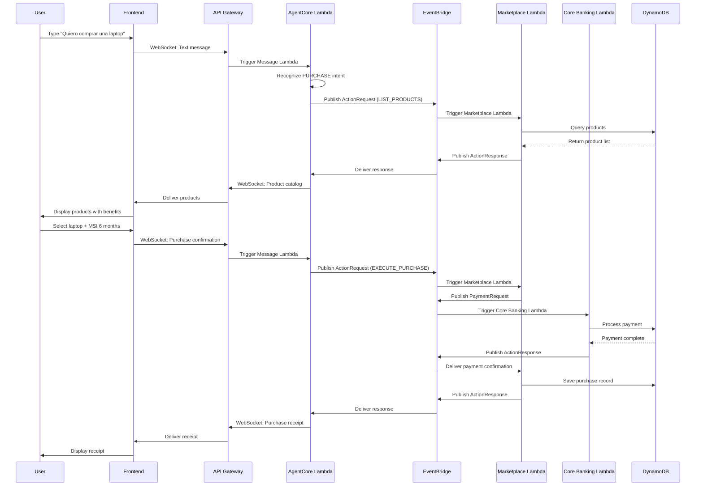

# Deployment Architecture - Unit 1: Infrastructure Foundation

## Overview

This document describes the deployment architecture for CENTLI's infrastructure foundation, including resource relationships, deployment sequence, and integration patterns.

---

## Infrastructure Architecture Diagram

```mermaid
graph TB
    subgraph "AWS Account: 777937796305"
        subgraph "Region: us-east-1"
            subgraph "Unit 1: Infrastructure Foundation"
                SAM[SAM Template<br/>centli-hackathon]
                EB[EventBridge Bus<br/>centli-event-bus]
                S3[S3 Bucket<br/>centli-assets-777937796305]
                IAM[IAM Role<br/>CentliLambdaExecutionRole]
                CW[CloudWatch Logs<br/>/aws/lambda/centli]
            end
            
            subgraph "Unit 2: AgentCore & Orchestration"
                APIGW[API Gateway WebSocket<br/>centli-websocket-api]
                L2A[Lambda: Connect]
                L2B[Lambda: Disconnect]
                L2C[Lambda: Message]
                DDB2[DynamoDB: Sessions]
                BEDROCK[Bedrock AgentCore<br/>Claude 3.7 Sonnet]
            end
            
            subgraph "Unit 3: Action Groups"
                L3A[Lambda: Core Banking]
                L3B[Lambda: Marketplace]
                L3C[Lambda: CRM]
                DDB3A[DynamoDB: Accounts]
                DDB3B[DynamoDB: Transactions]
                DDB3C[DynamoDB: Products]
                DDB3D[DynamoDB: Purchases]
                DDB3E[DynamoDB: Beneficiaries]
                DDB3F[DynamoDB: UserProfiles]
            end
            
            subgraph "Unit 4: Frontend"
                FE[Static Website<br/>HTML/CSS/JS]
            end
        end
    end
    
    %% Infrastructure Dependencies
    SAM -.creates.-> EB
    SAM -.creates.-> S3
    SAM -.creates.-> IAM
    SAM -.creates.-> CW
    
    %% Unit 2 Dependencies
    L2A -.uses.-> IAM
    L2B -.uses.-> IAM
    L2C -.uses.-> IAM
    L2A -.logs to.-> CW
    L2B -.logs to.-> CW
    L2C -.logs to.-> CW
    L2C -.publishes to.-> EB
    L2C -.subscribes to.-> EB
    L2C -.reads/writes.-> S3
    L2C -.invokes.-> BEDROCK
    
    %% Unit 3 Dependencies
    L3A -.uses.-> IAM
    L3B -.uses.-> IAM
    L3C -.uses.-> IAM
    L3A -.logs to.-> CW
    L3B -.logs to.-> CW
    L3C -.logs to.-> CW
    L3A -.subscribes to.-> EB
    L3B -.subscribes to.-> EB
    L3C -.subscribes to.-> EB
    L3A -.publishes to.-> EB
    L3B -.publishes to.-> EB
    L3C -.publishes to.-> EB
    
    %% Unit 4 Dependencies
    FE -.connects to.-> APIGW
    FE -.uploads to.-> S3
    
    %% User Interactions
    USER[User] -->|WebSocket| APIGW
    USER -->|Voice/Text/Image| FE
    APIGW -->|triggers| L2A
    APIGW -->|triggers| L2B
    APIGW -->|triggers| L2C
    
    style SAM fill:#ff9900
    style EB fill:#ff9900
    style S3 fill:#ff9900
    style IAM fill:#ff9900
    style CW fill:#ff9900
```



---

## Deployment Sequence

### Phase 1: Infrastructure Foundation (Unit 1)

**Duration**: 15 minutes  
**Order**: 1st (foundation for all other units)



**Resources Created**:
1. EventBridge Event Bus (`centli-event-bus`)
2. S3 Bucket (`centli-assets-777937796305`)
3. IAM Role (`CentliLambdaExecutionRole`)
4. CloudWatch Log Group (`/aws/lambda/centli`)

**Validation**:
```bash
# Verify stack status
aws cloudformation describe-stacks \
  --stack-name centli-hackathon \
  --profile 777937796305_Ps-HackatonAgentic-Mexico \
  --region us-east-1 \
  --query 'Stacks[0].StackStatus'

# Expected: CREATE_COMPLETE

# Get outputs
aws cloudformation describe-stacks \
  --stack-name centli-hackathon \
  --profile 777937796305_Ps-HackatonAgentic-Mexico \
  --region us-east-1 \
  --query 'Stacks[0].Outputs'
```

---

### Phase 2: AgentCore & Orchestration (Unit 2)

**Duration**: 30 minutes  
**Order**: 2nd (depends on Unit 1)  
**Dependencies**: EventBridge Bus, S3 Bucket, IAM Role, CloudWatch Logs

**Resources Created**:
1. API Gateway WebSocket API
2. Lambda: Connect Handler
3. Lambda: Disconnect Handler
4. Lambda: Message Handler
5. DynamoDB Table: Sessions
6. Bedrock Agent Configuration

**Integration Points**:
- Uses `EventBusArn` from Unit 1 outputs
- Uses `AssetsBucketName` from Unit 1 outputs
- Uses `LambdaExecutionRoleArn` from Unit 1 outputs
- Logs to `/aws/lambda/centli`

---

### Phase 3: Action Groups (Unit 3)

**Duration**: 30 minutes  
**Order**: 3rd (depends on Unit 1, parallel with Unit 2)  
**Dependencies**: EventBridge Bus, IAM Role, CloudWatch Logs

**Resources Created**:
1. Lambda: Core Banking Mock
2. Lambda: Marketplace Mock
3. Lambda: CRM Mock
4. DynamoDB Tables: Accounts, Transactions, Products, Purchases, Beneficiaries, UserProfiles
5. EventBridge Rules (subscribe to ActionRequest events)

**Integration Points**:
- Uses `EventBusArn` from Unit 1 outputs
- Uses `LambdaExecutionRoleArn` from Unit 1 outputs
- Logs to `/aws/lambda/centli`

---

### Phase 4: Frontend (Unit 4)

**Duration**: 15 minutes  
**Order**: 4th (depends on Units 1, 2)  
**Dependencies**: S3 Bucket, API Gateway WebSocket

**Resources Created**:
1. Static website files (HTML/CSS/JS)
2. Optional: S3 Static Website Hosting
3. Optional: CloudFront Distribution

**Integration Points**:
- Connects to WebSocket API from Unit 2
- Uploads images to S3 bucket from Unit 1

---

## Resource Dependencies Matrix

| Resource | Depends On | Used By | Critical Path |
|----------|-----------|---------|--------------|
| EventBridge Bus | None | Units 2, 3 | Yes |
| S3 Bucket | None | Units 2, 4 | No |
| IAM Role | None | Units 2, 3 | Yes |
| CloudWatch Logs | None | Units 2, 3 | No |
| WebSocket API | IAM Role | Unit 4 | Yes |
| AgentCore Lambdas | EventBridge, S3, IAM, Logs | Unit 4 | Yes |
| Action Group Lambdas | EventBridge, IAM, Logs | Unit 2 | Yes |
| Frontend | WebSocket API, S3 | Users | Yes |

**Critical Path**: Unit 1 → Unit 2 → Unit 4  
**Parallel Path**: Unit 1 → Unit 3 (can deploy alongside Unit 2)

---

## Stack Outputs and Cross-References

### Unit 1 Outputs

```yaml
Outputs:
  EventBusArn:
    Description: EventBridge Event Bus ARN
    Value: !GetAtt CentliEventBus.Arn
    Export:
      Name: centli-hackathon-EventBusArn
  
  AssetsBucketName:
    Description: S3 Assets Bucket Name
    Value: !Ref CentliAssetsBucket
    Export:
      Name: centli-hackathon-AssetsBucketName
  
  LambdaExecutionRoleArn:
    Description: Lambda Execution Role ARN
    Value: !GetAtt CentliLambdaExecutionRole.Arn
    Export:
      Name: centli-hackathon-LambdaExecutionRoleArn
  
  LogGroupName:
    Description: CloudWatch Log Group Name
    Value: !Ref CentliLogGroup
    Export:
      Name: centli-hackathon-LogGroupName
```

### How Units Reference Outputs

**Unit 2 (AgentCore) References**:
```yaml
Environment:
  Variables:
    EVENT_BUS_NAME: !Ref CentliEventBus
    ASSETS_BUCKET_NAME: !Ref CentliAssetsBucket

Role: !GetAtt CentliLambdaExecutionRole.Arn
```

**Unit 3 (Action Groups) References**:
```yaml
Environment:
  Variables:
    EVENT_BUS_NAME: !Ref CentliEventBus

Role: !GetAtt CentliLambdaExecutionRole.Arn
```

**Unit 4 (Frontend) References**:
```javascript
// Frontend JavaScript
const WEBSOCKET_URL = '<WebSocket API URL from Unit 2>';
const ASSETS_BUCKET = 'centli-assets-777937796305';
```

---

## Event Flow Architecture

### Transfer Flow (Voice)



### Purchase Flow (Text)



---

## Deployment Commands

### Initial Deployment

```bash
# Step 1: Build SAM application
sam build

# Step 2: Deploy to AWS
sam deploy \
  --stack-name centli-hackathon \
  --profile 777937796305_Ps-HackatonAgentic-Mexico \
  --region us-east-1 \
  --capabilities CAPABILITY_NAMED_IAM \
  --parameter-overrides \
    Environment=hackathon \
    LogLevel=INFO

# Step 3: Get stack outputs
aws cloudformation describe-stacks \
  --stack-name centli-hackathon \
  --profile 777937796305_Ps-HackatonAgentic-Mexico \
  --region us-east-1 \
  --query 'Stacks[0].Outputs' \
  --output table
```

### Update Deployment

```bash
# Rebuild and redeploy
sam build && sam deploy \
  --stack-name centli-hackathon \
  --profile 777937796305_Ps-HackatonAgentic-Mexico \
  --region us-east-1 \
  --no-confirm-changeset
```

### Delete Stack

```bash
# Delete all resources
aws cloudformation delete-stack \
  --stack-name centli-hackathon \
  --profile 777937796305_Ps-HackatonAgentic-Mexico \
  --region us-east-1

# Wait for deletion
aws cloudformation wait stack-delete-complete \
  --stack-name centli-hackathon \
  --profile 777937796305_Ps-HackatonAgentic-Mexico \
  --region us-east-1
```

---

## Monitoring and Observability

### CloudWatch Dashboards

**Recommended Dashboard Widgets**:
1. Lambda Invocations (all functions)
2. Lambda Errors (all functions)
3. Lambda Duration (all functions)
4. EventBridge Events Published
5. EventBridge Events Delivered
6. DynamoDB Read/Write Capacity
7. API Gateway WebSocket Connections
8. S3 Bucket Requests

### CloudWatch Alarms

**Critical Alarms** (optional for hackathon):
1. Lambda Error Rate > 10%
2. EventBridge Failed Invocations > 5
3. DynamoDB Throttled Requests > 0
4. API Gateway 5xx Errors > 10

### Log Insights Queries

**Query 1: All Errors**
```
fields @timestamp, level, unit, function, message
| filter level = "ERROR"
| sort @timestamp desc
| limit 100
```

**Query 2: Transfer Operations**
```
fields @timestamp, unit, message, context.user_id, context.amount
| filter message like /transfer/
| sort @timestamp desc
```

**Query 3: Lambda Performance**
```
fields @timestamp, function, @duration
| stats avg(@duration), max(@duration), min(@duration) by function
```

---

## Rollback Strategy

### Automatic Rollback

CloudFormation automatically rolls back on deployment failure:
- Failed resource creation → Delete created resources
- Failed resource update → Revert to previous state

### Manual Rollback

```bash
# Rollback to previous stack version
aws cloudformation rollback-stack \
  --stack-name centli-hackathon \
  --profile 777937796305_Ps-HackatonAgentic-Mexico \
  --region us-east-1
```

### Disaster Recovery

**Backup Strategy**:
- DynamoDB: Point-in-time recovery (optional)
- S3: Versioning enabled (optional)
- CloudFormation: Template stored in Git

**Recovery Steps**:
1. Delete failed stack
2. Fix template issues
3. Redeploy from Git
4. Restore DynamoDB data (if needed)
5. Restore S3 objects (if needed)

---

## Performance Optimization

### Lambda Optimization

- **Memory**: 512 MB (balance cost/performance)
- **Timeout**: 30 seconds (sufficient for most operations)
- **Provisioned Concurrency**: Not needed for hackathon
- **Reserved Concurrency**: Not needed for hackathon

### DynamoDB Optimization

- **Capacity Mode**: On-demand (no capacity planning needed)
- **GSI**: Only where needed (user-index, category-index)
- **TTL**: Enabled on Sessions table (auto-cleanup)

### EventBridge Optimization

- **Event Batching**: Not needed for hackathon
- **Dead Letter Queue**: Optional for production

---

## Security Best Practices

### Applied in Unit 1

✅ IAM least privilege (scoped to specific resources)  
✅ S3 bucket public access blocked  
✅ CORS restricted to localhost origins  
✅ CloudWatch Logs encrypted at rest  
✅ EventBridge events stay within account  
✅ No hardcoded credentials in code

### Production Recommendations

- Enable S3 bucket versioning
- Enable S3 bucket encryption (SSE-S3 or SSE-KMS)
- Enable DynamoDB encryption at rest
- Enable API Gateway access logging
- Implement API Gateway throttling
- Add AWS WAF for API Gateway
- Enable CloudTrail for audit logging
- Implement secrets management (AWS Secrets Manager)

---

## Summary

Unit 1 deployment architecture provides:
- ✅ Clear deployment sequence (Unit 1 → Units 2,3,4)
- ✅ Resource dependency mapping
- ✅ Event flow diagrams for key scenarios
- ✅ Stack outputs for cross-unit references
- ✅ Deployment commands and validation steps
- ✅ Monitoring and observability setup
- ✅ Rollback and disaster recovery strategy
- ✅ Performance optimization guidelines
- ✅ Security best practices

**Estimated Deployment Time**: 15 minutes for Unit 1, 90 minutes total for all units

**Next Steps**: Proceed to Code Generation to create the actual SAM template (`template.yaml`) and deployment scripts.
