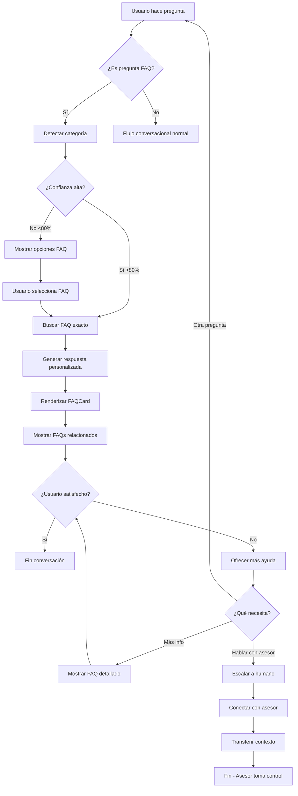
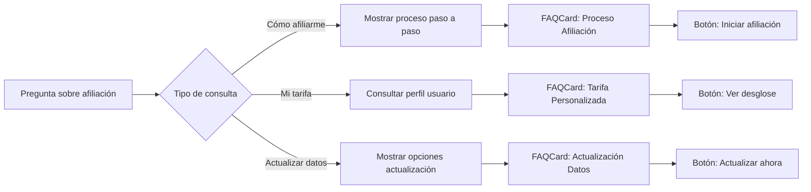
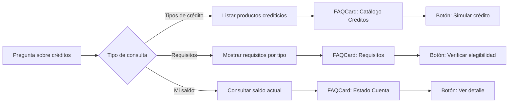
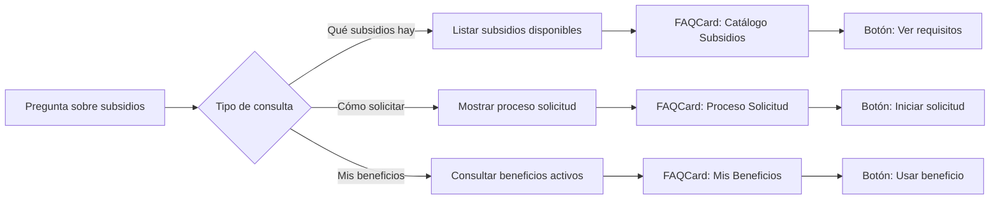

# 🎯 Diseño Completo: Sistema de Preguntas Frecuentes (FAQ)
## Comfi - Asistente Financiero Inspirado en Comfama

**Versión:** 1.0  
**Fecha:** 2024  
**Diseñador UX/UI:** Sistema Conversacional Financiero  
**Inspiración:** Comfama - Caja de Compensación Familiar de Antioquia

---

## 📋 ÍNDICE

1. [Contexto y Objetivos](#contexto)
2. [Arquitectura del Sistema FAQ](#arquitectura)
3. [Flujos Conversacionales](#flujos)
4. [Categorías y Contenido FAQ](#categorias)
5. [Componentes Visuales](#componentes)
6. [Especificaciones Técnicas](#especificaciones)
7. [Guía de Estilo Conversacional](#guia-estilo)
8. [Integración con Backend](#integracion)

---

## 🎯 CONTEXTO Y OBJETIVOS {#contexto}

### Sobre Comfama
- **Organización:** Caja de Compensación Familiar en Antioquia, Colombia
- **Misión:** Bienestar social y progreso de trabajadores y sus familias
- **Servicios:** Créditos, subsidios de vivienda, educación, recreación, salud, cultura
- **Valores:** Cercanía, confianza, inclusión social

### Objetivos del Sistema FAQ
1. **Reducir carga operativa:** Responder automáticamente 70% de consultas frecuentes
2. **Mejorar experiencia:** Respuestas instantáneas 24/7
3. **Personalización:** Contextualizar respuestas según perfil del usuario
4. **Escalamiento inteligente:** Derivar a asesor humano cuando sea necesario
5. **Educación financiera:** Aprovechar FAQ para educar sobre servicios


---

## 🏗️ ARQUITECTURA DEL SISTEMA FAQ {#arquitectura}

### Componentes Principales

```
┌─────────────────────────────────────────────────────────────┐
│                    USUARIO (Texto/Voz)                      │
└────────────────────────┬────────────────────────────────────┘
                         │
                         ▼
┌─────────────────────────────────────────────────────────────┐
│              ChatWidget (Frontend React)                    │
│  • Captura input (texto/voz)                               │
│  • Renderiza respuestas FAQ                                │
│  • Muestra componentes interactivos                        │
└────────────────────────┬────────────────────────────────────┘
                         │
                         ▼
┌─────────────────────────────────────────────────────────────┐
│           WebSocket Connection (Real-time)                  │
│  • Streaming de respuestas                                 │
│  • Manejo de sesión                                        │
└────────────────────────┬────────────────────────────────────┘
                         │
                         ▼
┌─────────────────────────────────────────────────────────────┐
│         Backend Agent (Bedrock + Nova Sonic)                │
│  • Detección de intención FAQ                              │
│  • Búsqueda en base de conocimiento                        │
│  • Generación de respuesta contextualizada                 │
│  • Decisión de escalamiento                                │
└────────────────────────┬────────────────────────────────────┘
                         │
                         ▼
┌─────────────────────────────────────────────────────────────┐
│              FAQ Knowledge Base                             │
│  • Categorías estructuradas                                │
│  • Respuestas predefinidas                                 │
│  • Metadata para personalización                           │
└─────────────────────────────────────────────────────────────┘
```

### Flujo de Datos

1. **Input del Usuario** → ChatWidget captura pregunta
2. **Envío WebSocket** → Mensaje enviado al backend
3. **Análisis de Intención** → Agent detecta si es FAQ
4. **Búsqueda Semántica** → Encuentra FAQ más relevante
5. **Personalización** → Adapta respuesta al contexto del usuario
6. **Streaming Response** → Respuesta enviada en tiempo real
7. **Renderizado Visual** → FAQCard muestra respuesta enriquecida
8. **Opciones Relacionadas** → Sugiere FAQs relacionados
9. **Escalamiento** → Opción de contactar asesor humano


---

## 🔄 FLUJOS CONVERSACIONALES {#flujos}

### Diagrama Principal: Flujo FAQ Completo



### Flujo por Categoría

#### 1. Afiliación y Tarifas



#### 2. Créditos y Servicios Financieros


#### 3. Subsidios y Beneficios



---

## 📚 CATEGORÍAS Y CONTENIDO FAQ {#categorias}

### Estructura de Categorías

```javascript
const faqCategories = {
  afiliacion: {
    id: 'afiliacion',
    name: 'Afiliación y Tarifas',
    icon: '👥',
    color: '#e6007e', // Rosa Comfama
    description: 'Todo sobre tu afiliación y tarifas'
  },
  creditos: {
    id: 'creditos',
    name: 'Créditos y Servicios Financieros',
    icon: '💰',
    color: '#ad37e0',
    description: 'Información sobre créditos y servicios'
  },
  subsidios: {
    id: 'subsidios',
    name: 'Subsidios y Beneficios',
    icon: '🎁',
    color: '#00a651',
    description: 'Conoce tus subsidios y beneficios'
  },
  servicios: {
    id: 'servicios',
    name: 'Servicios y Programas',
    icon: '🏫',
    color: '#0066cc',
    description: 'Educación, recreación y más'
  },
  cuenta: {
    id: 'cuenta',
    name: 'Cuenta y Transacciones',
    icon: '📊',
    color: '#ff6b00',
    description: 'Gestiona tu cuenta y transacciones'
  }
}
```

### Contenido FAQ Detallado

#### CATEGORÍA 1: Afiliación y Tarifas

##### FAQ 1.1: ¿Cómo me afilio a Comfama?
```javascript
{
  id: 'faq-afiliacion-001',
  category: 'afiliacion',
  question: '¿Cómo me afilio a Comfama?',
  shortAnswer: 'Tu empleador te afilia automáticamente al pagar aportes parafiscales.',
  detailedAnswer: `
    La afiliación a Comfama es automática cuando tu empleador realiza los aportes 
    parafiscales (4% del salario). No necesitas hacer ningún trámite adicional.
    
    **Pasos:**
    1. Tu empleador te registra en el sistema
    2. Recibes tu número de afiliación
    3. Puedes activar tu cuenta digital
    4. Accedes a todos los beneficios
  `,
  relatedQuestions: ['faq-afiliacion-002', 'faq-afiliacion-003'],
  actions: [
    {
      type: 'button',
      label: 'Activar cuenta digital',
      action: 'activate_account'
    },
    {
      type: 'button',
      label: 'Verificar mi afiliación',
      action: 'check_affiliation'
    }
  ],
  tags: ['afiliación', 'registro', 'empleador'],
  priority: 'high',
  lastUpdated: '2024-01-15'
}
```


##### FAQ 1.2: ¿Cuál es mi tarifa de afiliación?
```javascript
{
  id: 'faq-afiliacion-002',
  category: 'afiliacion',
  question: '¿Cuál es mi tarifa de afiliación?',
  shortAnswer: 'Tu tarifa depende de tu salario. Es el 4% que aporta tu empleador.',
  detailedAnswer: `
    La tarifa de afiliación es el 4% de tu salario mensual, que aporta tu empleador 
    directamente. Tú no pagas nada de tu bolsillo.
    
    **Ejemplo:**
    - Salario: $2,000,000 COP
    - Aporte mensual: $80,000 COP (4%)
    - Pagado por: Tu empleador
    
    Este aporte te da acceso a todos los servicios de Comfama.
  `,
  personalized: true, // Indica que se debe personalizar con datos del usuario
  relatedQuestions: ['faq-afiliacion-001', 'faq-subsidios-001'],
  actions: [
    {
      type: 'button',
      label: 'Ver mi tarifa actual',
      action: 'show_my_rate'
    },
    {
      type: 'button',
      label: 'Calcular beneficios',
      action: 'calculate_benefits'
    }
  ],
  tags: ['tarifa', 'aporte', 'salario'],
  priority: 'high'
}
```

##### FAQ 1.3: ¿Cómo actualizo mis datos?
```javascript
{
  id: 'faq-afiliacion-003',
  category: 'afiliacion',
  question: '¿Cómo actualizo mis datos personales?',
  shortAnswer: 'Puedes actualizar tus datos en línea, en nuestras sedes o por teléfono.',
  detailedAnswer: `
    Mantener tus datos actualizados es importante para recibir todos los beneficios.
    
    **Opciones para actualizar:**
    
    1. **En línea** (más rápido)
       - Ingresa a tu cuenta
       - Ve a "Mi perfil"
       - Actualiza la información
       - Guarda los cambios
    
    2. **En nuestras sedes**
       - Lleva tu cédula
       - Acércate al módulo de atención
       - Solicita actualización de datos
    
    3. **Por teléfono**
       - Llama al 604 360 6060
       - Opción 2: Actualización de datos
       - Sigue las instrucciones
  `,
  relatedQuestions: ['faq-cuenta-003', 'faq-afiliacion-001'],
  actions: [
    {
      type: 'button',
      label: 'Actualizar ahora',
      action: 'update_profile'
    },
    {
      type: 'button',
      label: 'Ver sedes cercanas',
      action: 'find_offices'
    }
  ],
  tags: ['actualización', 'datos', 'perfil'],
  priority: 'medium'
}
```


#### CATEGORÍA 2: Créditos y Servicios Financieros

##### FAQ 2.1: ¿Qué tipos de créditos ofrecen?
```javascript
{
  id: 'faq-creditos-001',
  category: 'creditos',
  question: '¿Qué tipos de créditos ofrece Comfama?',
  shortAnswer: 'Ofrecemos créditos de vivienda, educación, libre inversión y vehículo.',
  detailedAnswer: `
    Comfama ofrece diferentes líneas de crédito para apoyar tu bienestar:
    
    **1. Crédito de Vivienda** 🏠
    - Compra de vivienda nueva o usada
    - Mejoramiento de vivienda
    - Tasas preferenciales
    - Hasta 20 años plazo
    
    **2. Crédito de Educación** 📚
    - Pregrado y posgrado
    - Cursos y diplomados
    - Sin codeudor
    - Hasta 5 años plazo
    
    **3. Crédito de Libre Inversión** 💰
    - Para cualquier necesidad
    - Aprobación rápida
    - Hasta 4 años plazo
    - Tasas competitivas
    
    **4. Crédito de Vehículo** 🚗
    - Compra de vehículo nuevo o usado
    - Hasta 5 años plazo
    - Tasas preferenciales
  `,
  relatedQuestions: ['faq-creditos-002', 'faq-creditos-003'],
  actions: [
    {
      type: 'button',
      label: 'Simular crédito',
      action: 'simulate_credit'
    },
    {
      type: 'button',
      label: 'Ver requisitos',
      action: 'show_requirements'
    },
    {
      type: 'button',
      label: 'Solicitar crédito',
      action: 'apply_credit'
    }
  ],
  tags: ['crédito', 'préstamo', 'financiación'],
  priority: 'high'
}
```

##### FAQ 2.2: ¿Cuáles son los requisitos para un crédito?
```javascript
{
  id: 'faq-creditos-002',
  category: 'creditos',
  question: '¿Qué requisitos necesito para solicitar un crédito?',
  shortAnswer: 'Ser afiliado activo, tener capacidad de pago y presentar documentación.',
  detailedAnswer: `
    Los requisitos varían según el tipo de crédito, pero en general necesitas:
    
    **Requisitos Generales:**
    ✅ Ser afiliado activo de Comfama
    ✅ Tener al menos 6 meses de afiliación
    ✅ Capacidad de pago demostrable
    ✅ No tener créditos en mora
    
    **Documentación:**
    📄 Cédula de ciudadanía
    📄 Certificado laboral (no mayor a 30 días)
    📄 Últimos 3 desprendibles de pago
    📄 Extractos bancarios (últimos 3 meses)
    
    **Requisitos Específicos por Tipo:**
    
    🏠 **Vivienda:** Promesa de compraventa, avalúo
    📚 **Educación:** Carta de admisión, costos
    🚗 **Vehículo:** Cotización del vehículo
  `,
  personalized: true,
  relatedQuestions: ['faq-creditos-001', 'faq-creditos-003'],
  actions: [
    {
      type: 'button',
      label: 'Verificar mi elegibilidad',
      action: 'check_eligibility'
    },
    {
      type: 'button',
      label: 'Iniciar solicitud',
      action: 'start_application'
    }
  ],
  tags: ['requisitos', 'documentos', 'elegibilidad'],
  priority: 'high'
}
```


##### FAQ 2.3: ¿Cómo consulto mi saldo de crédito?
```javascript
{
  id: 'faq-creditos-003',
  category: 'creditos',
  question: '¿Cómo puedo consultar el saldo de mi crédito?',
  shortAnswer: 'Consulta tu saldo en línea, por app, teléfono o en nuestras sedes.',
  detailedAnswer: `
    Tienes varias opciones para consultar el saldo de tu crédito:
    
    **1. En Línea** 💻 (Recomendado)
    - Ingresa a comfama.com
    - Ve a "Mi cuenta"
    - Selecciona "Mis créditos"
    - Verás saldo, cuotas y estado
    
    **2. App Móvil** 📱
    - Descarga la app Comfama
    - Ingresa con tu usuario
    - Toca "Créditos"
    - Consulta toda la información
    
    **3. Por Teléfono** ☎️
    - Llama al 604 360 6060
    - Opción 3: Créditos
    - Sigue las instrucciones
    
    **4. En Nuestras Sedes** 🏢
    - Acércate con tu cédula
    - Solicita estado de cuenta
    - Recibe información impresa
  `,
  personalized: true,
  relatedQuestions: ['faq-cuenta-001', 'faq-creditos-002'],
  actions: [
    {
      type: 'button',
      label: 'Ver mi saldo ahora',
      action: 'show_credit_balance'
    },
    {
      type: 'button',
      label: 'Descargar estado de cuenta',
      action: 'download_statement'
    }
  ],
  tags: ['saldo', 'consulta', 'estado de cuenta'],
  priority: 'high'
}
```

#### CATEGORÍA 3: Subsidios y Beneficios

##### FAQ 3.1: ¿Qué subsidios están disponibles?
```javascript
{
  id: 'faq-subsidios-001',
  category: 'subsidios',
  question: '¿Qué subsidios ofrece Comfama?',
  shortAnswer: 'Ofrecemos subsidios de vivienda, educación, salud y recreación.',
  detailedAnswer: `
    Comfama ofrece diversos subsidios para mejorar tu calidad de vida:
    
    **1. Subsidio de Vivienda** 🏠
    - Compra de vivienda VIS
    - Mejoramiento de vivienda
    - Hasta $30 millones
    - Según nivel de ingresos
    
    **2. Subsidio de Educación** 📚
    - Útiles escolares
    - Uniformes
    - Matrículas
    - Cursos y capacitaciones
    
    **3. Subsidio de Salud** 🏥
    - Medicamentos
    - Exámenes médicos
    - Tratamientos especiales
    - Según necesidad
    
    **4. Subsidio de Recreación** 🎉
    - Vacaciones recreativas
    - Eventos culturales
    - Actividades deportivas
    - Para toda la familia
    
    **Nota:** Los subsidios dependen de tu nivel de ingresos y composición familiar.
  `,
  personalized: true,
  relatedQuestions: ['faq-subsidios-002', 'faq-subsidios-003'],
  actions: [
    {
      type: 'button',
      label: 'Ver mis subsidios disponibles',
      action: 'show_available_subsidies'
    },
    {
      type: 'button',
      label: 'Calcular subsidio',
      action: 'calculate_subsidy'
    }
  ],
  tags: ['subsidios', 'beneficios', 'ayudas'],
  priority: 'high'
}
```


---

## 🎨 COMPONENTES VISUALES {#componentes}

### 1. FAQCard Component

Componente principal para mostrar respuestas FAQ de forma visual y atractiva.

#### Mockup Visual (Descripción)

```
┌─────────────────────────────────────────────────────────┐
│  [Icono]  CATEGORÍA                          [Útil? 👍👎] │
├─────────────────────────────────────────────────────────┤
│                                                         │
│  ¿Pregunta del usuario?                                 │
│                                                         │
│  Respuesta clara y concisa con formato visual:         │
│  • Bullets para claridad                               │
│  • Emojis para contexto                                │
│  • Negritas para énfasis                               │
│                                                         │
│  ┌─────────────────┐  ┌─────────────────┐             │
│  │ [Botón Acción 1]│  │ [Botón Acción 2]│             │
│  └─────────────────┘  └─────────────────┘             │
│                                                         │
│  📌 Preguntas relacionadas:                            │
│  • ¿Otra pregunta relacionada?                         │
│  • ¿Más información sobre esto?                        │
│                                                         │
│  [¿Necesitas más ayuda? Habla con un asesor]          │
└─────────────────────────────────────────────────────────┘
```

#### Estados del Componente

**Estado 1: Loading**
```
┌─────────────────────────────────────────────────────────┐
│  [Icono animado]  Buscando respuesta...                 │
│                                                         │
│  ▓▓▓▓▓▓▓▓░░░░░░░░░░░░░░░░░░░░░░░░░░░░░░░░░░░░░░░░░░░  │
│                                                         │
│  Estoy consultando la información más actualizada...   │
└─────────────────────────────────────────────────────────┘
```

**Estado 2: Success (Respuesta encontrada)**
```
┌─────────────────────────────────────────────────────────┐
│  💰 CRÉDITOS Y SERVICIOS FINANCIEROS        [👍 Útil]   │
├─────────────────────────────────────────────────────────┤
│  ¿Qué tipos de créditos ofrece Comfama?                │
│                                                         │
│  Comfama ofrece diferentes líneas de crédito:          │
│                                                         │
│  🏠 Crédito de Vivienda                                 │
│  📚 Crédito de Educación                                │
│  💰 Crédito de Libre Inversión                          │
│  🚗 Crédito de Vehículo                                 │
│                                                         │
│  [Simular crédito]  [Ver requisitos]                   │
│                                                         │
│  📌 También te puede interesar:                        │
│  • ¿Cuáles son los requisitos?                         │
│  • ¿Cómo consulto mi saldo?                            │
│                                                         │
│  [¿Necesitas más ayuda? Habla con un asesor]          │
└─────────────────────────────────────────────────────────┘
```

**Estado 3: Partial Match (Baja confianza)**
```
┌─────────────────────────────────────────────────────────┐
│  ❓ ¿Te refieres a alguna de estas preguntas?           │
├─────────────────────────────────────────────────────────┤
│                                                         │
│  Encontré estas opciones relacionadas:                 │
│                                                         │
│  1️⃣ ¿Qué tipos de créditos ofrecen?                    │
│     Conoce nuestras líneas de crédito                  │
│                                                         │
│  2️⃣ ¿Cuáles son los requisitos para un crédito?        │
│     Requisitos y documentación necesaria               │
│                                                         │
│  3️⃣ ¿Cómo consulto mi saldo de crédito?                │
│     Opciones para consultar tu saldo                   │
│                                                         │
│  [Selecciona una opción]                               │
│                                                         │
│  O escribe tu pregunta de otra forma                   │
└─────────────────────────────────────────────────────────┘
```


**Estado 4: Error**
```
┌─────────────────────────────────────────────────────────┐
│  ⚠️ No pude encontrar una respuesta                     │
├─────────────────────────────────────────────────────────┤
│                                                         │
│  Lo siento, no encontré información sobre eso.         │
│                                                         │
│  Puedes intentar:                                      │
│  • Reformular tu pregunta                              │
│  • Explorar categorías de ayuda                        │
│  • Hablar con un asesor humano                         │
│                                                         │
│  [Ver todas las categorías]  [Hablar con asesor]      │
└─────────────────────────────────────────────────────────┘
```

### 2. FAQCategoryGrid Component

Muestra categorías FAQ para exploración.

```
┌─────────────────────────────────────────────────────────┐
│  ¿En qué puedo ayudarte hoy?                           │
├─────────────────────────────────────────────────────────┤
│                                                         │
│  ┌──────────────┐  ┌──────────────┐  ┌──────────────┐ │
│  │   👥         │  │   💰         │  │   🎁         │ │
│  │ Afiliación   │  │  Créditos    │  │  Subsidios   │ │
│  │  y Tarifas   │  │ Financieros  │  │ y Beneficios │ │
│  │              │  │              │  │              │ │
│  │  12 preguntas│  │  15 preguntas│  │  10 preguntas│ │
│  └──────────────┘  └──────────────┘  └──────────────┘ │
│                                                         │
│  ┌──────────────┐  ┌──────────────┐                   │
│  │   🏫         │  │   📊         │                   │
│  │  Servicios   │  │   Cuenta y   │                   │
│  │  y Programas │  │Transacciones │                   │
│  │              │  │              │                   │
│  │  8 preguntas │  │  7 preguntas │                   │
│  └──────────────┘  └──────────────┘                   │
│                                                         │
│  O escribe tu pregunta directamente                    │
└─────────────────────────────────────────────────────────┘
```

### 3. FAQQuickActions Component

Acciones rápidas para preguntas más frecuentes.

```
┌─────────────────────────────────────────────────────────┐
│  ⚡ Preguntas frecuentes                                │
├─────────────────────────────────────────────────────────┤
│                                                         │
│  [¿Cómo me afilio?]  [¿Cuál es mi tarifa?]            │
│                                                         │
│  [Tipos de créditos]  [Consultar saldo]               │
│                                                         │
│  [Subsidios disponibles]  [Actualizar datos]          │
│                                                         │
│  [Ver todas las preguntas →]                           │
└─────────────────────────────────────────────────────────┘
```

### 4. FAQRelatedQuestions Component

Muestra preguntas relacionadas al final de una respuesta.

```
┌─────────────────────────────────────────────────────────┐
│  📌 También te puede interesar:                        │
├─────────────────────────────────────────────────────────┤
│                                                         │
│  → ¿Cuáles son los requisitos para un crédito?        │
│  → ¿Cómo consulto mi saldo de crédito?                │
│  → ¿Qué documentos necesito?                           │
│                                                         │
└─────────────────────────────────────────────────────────┘
```

### 5. FAQFeedback Component

Captura feedback del usuario sobre la utilidad de la respuesta.

```
┌─────────────────────────────────────────────────────────┐
│  ¿Te fue útil esta respuesta?                          │
│                                                         │
│  [👍 Sí, me ayudó]  [👎 No, necesito más ayuda]       │
│                                                         │
│  (Si selecciona 👎)                                     │
│  ┌───────────────────────────────────────────────────┐ │
│  │ ¿Qué podemos mejorar?                             │ │
│  │ [Textarea para comentarios]                       │ │
│  │                                                   │ │
│  │ [Enviar feedback]  [Hablar con asesor]           │ │
│  └───────────────────────────────────────────────────┘ │
└─────────────────────────────────────────────────────────┘
```


---

## 💻 ESPECIFICACIONES TÉCNICAS {#especificaciones}

### Estructura de Archivos

```
frontend/src/
├── components/
│   ├── FAQ/
│   │   ├── FAQCard.jsx
│   │   ├── FAQCard.css
│   │   ├── FAQCategoryGrid.jsx
│   │   ├── FAQCategoryGrid.css
│   │   ├── FAQQuickActions.jsx
│   │   ├── FAQQuickActions.css
│   │   ├── FAQRelatedQuestions.jsx
│   │   ├── FAQRelatedQuestions.css
│   │   ├── FAQFeedback.jsx
│   │   ├── FAQFeedback.css
│   │   └── index.js
│   └── Chat/
│       ├── ChatWidget.jsx (modificar para integrar FAQ)
│       └── ChatWidget.css
├── data/
│   ├── faqData.js (base de conocimiento FAQ)
│   └── faqCategories.js
├── hooks/
│   └── useFAQ.js (lógica de búsqueda y matching)
└── utils/
    └── faqMatcher.js (algoritmo de matching semántico)
```

### Component: FAQCard.jsx

```jsx
import { useState } from 'react'
import './FAQCard.css'

const FAQCard = ({ 
  faq, 
  onActionClick, 
  onRelatedClick,
  onFeedback,
  isPersonalized = false 
}) => {
  const [showFeedback, setShowFeedback] = useState(false)
  const [feedbackGiven, setFeedbackGiven] = useState(false)

  const handleFeedback = (isHelpful) => {
    setFeedbackGiven(true)
    onFeedback?.(faq.id, isHelpful)
    
    if (!isHelpful) {
      setShowFeedback(true)
    }
  }

  const getCategoryColor = (category) => {
    const colors = {
      afiliacion: '#e6007e',
      creditos: '#ad37e0',
      subsidios: '#00a651',
      servicios: '#0066cc',
      cuenta: '#ff6b00'
    }
    return colors[category] || '#ad37e0'
  }

  return (
    <div className="faq-card">
      {/* Header */}
      <div 
        className="faq-card-header"
        style={{ borderLeftColor: getCategoryColor(faq.category) }}
      >
        <div className="faq-category">
          <span className="faq-icon">{faq.categoryIcon}</span>
          <span className="faq-category-name">{faq.categoryName}</span>
        </div>
        
        {!feedbackGiven && (
          <div className="faq-feedback-quick">
            <button 
              className="feedback-btn helpful"
              onClick={() => handleFeedback(true)}
              title="Útil"
            >
              👍
            </button>
            <button 
              className="feedback-btn not-helpful"
              onClick={() => handleFeedback(false)}
              title="No útil"
            >
              👎
            </button>
          </div>
        )}
      </div>

      {/* Question */}
      <div className="faq-question">
        {faq.question}
      </div>

      {/* Answer */}
      <div className="faq-answer">
        {isPersonalized && faq.personalizedAnswer ? (
          <div dangerouslySetInnerHTML={{ __html: faq.personalizedAnswer }} />
        ) : (
          <div dangerouslySetInnerHTML={{ __html: faq.detailedAnswer }} />
        )}
      </div>

      {/* Actions */}
      {faq.actions && faq.actions.length > 0 && (
        <div className="faq-actions">
          {faq.actions.map((action, index) => (
            <button
              key={index}
              className="faq-action-btn"
              onClick={() => onActionClick?.(action)}
            >
              {action.label}
            </button>
          ))}
        </div>
      )}

      {/* Related Questions */}
      {faq.relatedQuestions && faq.relatedQuestions.length > 0 && (
        <div className="faq-related">
          <div className="faq-related-title">
            📌 También te puede interesar:
          </div>
          <div className="faq-related-list">
            {faq.relatedQuestions.map((relatedId, index) => (
              <button
                key={index}
                className="faq-related-item"
                onClick={() => onRelatedClick?.(relatedId)}
              >
                → {relatedId.questionPreview}
              </button>
            ))}
          </div>
        </div>
      )}

      {/* Feedback Form */}
      {showFeedback && (
        <div className="faq-feedback-form">
          <div className="feedback-title">
            ¿Qué podemos mejorar?
          </div>
          <textarea
            className="feedback-textarea"
            placeholder="Cuéntanos cómo podemos ayudarte mejor..."
            rows={3}
          />
          <div className="feedback-actions">
            <button className="feedback-submit-btn">
              Enviar feedback
            </button>
            <button 
              className="feedback-escalate-btn"
              onClick={() => onActionClick?.({ action: 'escalate_to_human' })}
            >
              Hablar con asesor
            </button>
          </div>
        </div>
      )}

      {/* Escalation Option */}
      {!showFeedback && (
        <div className="faq-escalate">
          <button 
            className="faq-escalate-btn"
            onClick={() => onActionClick?.({ action: 'escalate_to_human' })}
          >
            ¿Necesitas más ayuda? Habla con un asesor
          </button>
        </div>
      )}
    </div>
  )
}

export default FAQCard
```


### Component: FAQCard.css

```css
/* FAQ Card Container */
.faq-card {
  background: white;
  border-radius: 16px;
  padding: 1.5rem;
  box-shadow: 0 4px 12px rgba(0, 0, 0, 0.08);
  margin: 1rem 0;
  animation: fadeInUp 0.4s ease;
  border: 1px solid #e8e8e8;
}

@keyframes fadeInUp {
  from {
    opacity: 0;
    transform: translateY(20px);
  }
  to {
    opacity: 1;
    transform: translateY(0);
  }
}

/* Header */
.faq-card-header {
  display: flex;
  justify-content: space-between;
  align-items: center;
  margin-bottom: 1rem;
  padding-left: 1rem;
  border-left: 4px solid #ad37e0;
}

.faq-category {
  display: flex;
  align-items: center;
  gap: 0.5rem;
}

.faq-icon {
  font-size: 1.5rem;
}

.faq-category-name {
  font-size: 0.875rem;
  font-weight: 600;
  color: #666;
  text-transform: uppercase;
  letter-spacing: 0.5px;
}

/* Quick Feedback */
.faq-feedback-quick {
  display: flex;
  gap: 0.5rem;
}

.feedback-btn {
  background: transparent;
  border: 2px solid #e8e8e8;
  border-radius: 50%;
  width: 36px;
  height: 36px;
  font-size: 1.25rem;
  cursor: pointer;
  transition: all 0.2s ease;
  display: flex;
  align-items: center;
  justify-content: center;
}

.feedback-btn:hover {
  transform: scale(1.1);
  border-color: #ad37e0;
}

.feedback-btn.helpful:hover {
  background: rgba(76, 175, 80, 0.1);
  border-color: #4caf50;
}

.feedback-btn.not-helpful:hover {
  background: rgba(244, 67, 54, 0.1);
  border-color: #f44336;
}

/* Question */
.faq-question {
  font-size: 1.25rem;
  font-weight: 700;
  color: #1a1a1a;
  margin-bottom: 1rem;
  line-height: 1.4;
}

/* Answer */
.faq-answer {
  font-size: 1rem;
  line-height: 1.7;
  color: #333;
  margin-bottom: 1.5rem;
}

.faq-answer strong {
  color: #1a1a1a;
  font-weight: 600;
}

.faq-answer ul {
  margin: 0.5rem 0;
  padding-left: 1.5rem;
}

.faq-answer li {
  margin: 0.5rem 0;
}

/* Actions */
.faq-actions {
  display: flex;
  flex-wrap: wrap;
  gap: 0.75rem;
  margin-bottom: 1.5rem;
}

.faq-action-btn {
  background: linear-gradient(135deg, #ad37e0 0%, #8b2bb3 100%);
  color: white;
  border: none;
  border-radius: 24px;
  padding: 0.75rem 1.5rem;
  font-size: 0.9rem;
  font-weight: 600;
  cursor: pointer;
  transition: all 0.3s cubic-bezier(0.4, 0, 0.2, 1);
  box-shadow: 0 4px 12px rgba(173, 55, 224, 0.3);
}

.faq-action-btn:hover {
  transform: translateY(-2px);
  box-shadow: 0 6px 16px rgba(173, 55, 224, 0.4);
}

/* Related Questions */
.faq-related {
  background: #f8f8f8;
  border-radius: 12px;
  padding: 1rem;
  margin-bottom: 1rem;
}

.faq-related-title {
  font-size: 0.9rem;
  font-weight: 600;
  color: #666;
  margin-bottom: 0.75rem;
}

.faq-related-list {
  display: flex;
  flex-direction: column;
  gap: 0.5rem;
}

.faq-related-item {
  background: white;
  border: 1px solid #e8e8e8;
  border-radius: 8px;
  padding: 0.75rem 1rem;
  text-align: left;
  font-size: 0.9rem;
  color: #333;
  cursor: pointer;
  transition: all 0.2s ease;
}

.faq-related-item:hover {
  border-color: #ad37e0;
  background: rgba(173, 55, 224, 0.05);
  transform: translateX(4px);
}

/* Feedback Form */
.faq-feedback-form {
  background: #fff8e1;
  border: 2px solid #ffd54f;
  border-radius: 12px;
  padding: 1rem;
  margin-bottom: 1rem;
}

.feedback-title {
  font-size: 0.95rem;
  font-weight: 600;
  color: #333;
  margin-bottom: 0.75rem;
}

.feedback-textarea {
  width: 100%;
  padding: 0.75rem;
  border: 2px solid #e8e8e8;
  border-radius: 8px;
  font-size: 0.9rem;
  font-family: inherit;
  resize: vertical;
  margin-bottom: 0.75rem;
}

.feedback-textarea:focus {
  outline: none;
  border-color: #ad37e0;
}

.feedback-actions {
  display: flex;
  gap: 0.75rem;
}

.feedback-submit-btn {
  flex: 1;
  background: #4caf50;
  color: white;
  border: none;
  border-radius: 8px;
  padding: 0.75rem;
  font-weight: 600;
  cursor: pointer;
  transition: all 0.2s ease;
}

.feedback-submit-btn:hover {
  background: #45a049;
  transform: translateY(-2px);
}

.feedback-escalate-btn {
  flex: 1;
  background: white;
  color: #ad37e0;
  border: 2px solid #ad37e0;
  border-radius: 8px;
  padding: 0.75rem;
  font-weight: 600;
  cursor: pointer;
  transition: all 0.2s ease;
}

.feedback-escalate-btn:hover {
  background: #ad37e0;
  color: white;
}

/* Escalate Button */
.faq-escalate {
  text-align: center;
  padding-top: 1rem;
  border-top: 1px solid #e8e8e8;
}

.faq-escalate-btn {
  background: transparent;
  color: #ad37e0;
  border: none;
  font-size: 0.9rem;
  font-weight: 600;
  cursor: pointer;
  transition: all 0.2s ease;
  text-decoration: underline;
}

.faq-escalate-btn:hover {
  color: #8b2bb3;
}

/* Responsive */
@media (max-width: 768px) {
  .faq-card {
    padding: 1rem;
  }

  .faq-question {
    font-size: 1.1rem;
  }

  .faq-actions {
    flex-direction: column;
  }

  .faq-action-btn {
    width: 100%;
  }

  .feedback-actions {
    flex-direction: column;
  }
}
```


### Component: FAQCategoryGrid.jsx

```jsx
import './FAQCategoryGrid.css'

const FAQCategoryGrid = ({ categories, onCategoryClick }) => {
  return (
    <div className="faq-category-grid-container">
      <div className="faq-category-grid-header">
        <h3>¿En qué puedo ayudarte hoy?</h3>
        <p>Explora nuestras categorías de ayuda</p>
      </div>

      <div className="faq-category-grid">
        {categories.map((category) => (
          <button
            key={category.id}
            className="faq-category-card"
            onClick={() => onCategoryClick(category.id)}
            style={{ borderTopColor: category.color }}
          >
            <div className="category-icon">{category.icon}</div>
            <div className="category-name">{category.name}</div>
            <div className="category-description">{category.description}</div>
            <div className="category-count">
              {category.questionCount} preguntas
            </div>
          </button>
        ))}
      </div>

      <div className="faq-category-footer">
        <p>O escribe tu pregunta directamente en el chat</p>
      </div>
    </div>
  )
}

export default FAQCategoryGrid
```

### Component: FAQQuickActions.jsx

```jsx
import './FAQQuickActions.css'

const FAQQuickActions = ({ quickFAQs, onQuickFAQClick }) => {
  return (
    <div className="faq-quick-actions">
      <div className="quick-actions-header">
        <span className="quick-icon">⚡</span>
        <span className="quick-title">Preguntas frecuentes</span>
      </div>

      <div className="quick-actions-grid">
        {quickFAQs.map((faq) => (
          <button
            key={faq.id}
            className="quick-action-item"
            onClick={() => onQuickFAQClick(faq.id)}
          >
            <span className="quick-faq-icon">{faq.icon}</span>
            <span className="quick-faq-text">{faq.shortQuestion}</span>
          </button>
        ))}
      </div>

      <button className="view-all-btn">
        Ver todas las preguntas →
      </button>
    </div>
  )
}

export default FAQQuickActions
```

### Hook: useFAQ.js

```javascript
import { useState, useCallback } from 'react'
import { faqData } from '../data/faqData'
import { matchFAQ } from '../utils/faqMatcher'

export const useFAQ = () => {
  const [currentFAQ, setCurrentFAQ] = useState(null)
  const [isSearching, setIsSearching] = useState(false)
  const [matchConfidence, setMatchConfidence] = useState(0)

  /**
   * Busca FAQ basado en la pregunta del usuario
   * @param {string} userQuestion - Pregunta del usuario
   * @returns {Object} - FAQ encontrado con nivel de confianza
   */
  const searchFAQ = useCallback(async (userQuestion) => {
    setIsSearching(true)
    
    try {
      // Simular búsqueda semántica (en producción usar embeddings)
      const result = matchFAQ(userQuestion, faqData)
      
      setCurrentFAQ(result.faq)
      setMatchConfidence(result.confidence)
      
      return {
        faq: result.faq,
        confidence: result.confidence,
        suggestions: result.suggestions
      }
    } catch (error) {
      console.error('Error searching FAQ:', error)
      return null
    } finally {
      setIsSearching(false)
    }
  }, [])

  /**
   * Obtiene FAQ por ID
   * @param {string} faqId - ID del FAQ
   * @returns {Object} - FAQ encontrado
   */
  const getFAQById = useCallback((faqId) => {
    return faqData.find(faq => faq.id === faqId)
  }, [])

  /**
   * Obtiene FAQs relacionados
   * @param {string} faqId - ID del FAQ actual
   * @returns {Array} - Lista de FAQs relacionados
   */
  const getRelatedFAQs = useCallback((faqId) => {
    const currentFAQ = getFAQById(faqId)
    if (!currentFAQ || !currentFAQ.relatedQuestions) {
      return []
    }
    
    return currentFAQ.relatedQuestions
      .map(id => getFAQById(id))
      .filter(Boolean)
  }, [getFAQById])

  /**
   * Obtiene FAQs por categoría
   * @param {string} categoryId - ID de la categoría
   * @returns {Array} - Lista de FAQs de la categoría
   */
  const getFAQsByCategory = useCallback((categoryId) => {
    return faqData.filter(faq => faq.category === categoryId)
  }, [])

  /**
   * Registra feedback del usuario
   * @param {string} faqId - ID del FAQ
   * @param {boolean} isHelpful - Si fue útil o no
   * @param {string} comment - Comentario opcional
   */
  const submitFeedback = useCallback(async (faqId, isHelpful, comment = '') => {
    try {
      // En producción, enviar al backend
      console.log('FAQ Feedback:', { faqId, isHelpful, comment })
      
      // Aquí se enviaría al backend para analytics
      return true
    } catch (error) {
      console.error('Error submitting feedback:', error)
      return false
    }
  }, [])

  return {
    currentFAQ,
    isSearching,
    matchConfidence,
    searchFAQ,
    getFAQById,
    getRelatedFAQs,
    getFAQsByCategory,
    submitFeedback
  }
}
```


### Utility: faqMatcher.js

```javascript
/**
 * Algoritmo de matching semántico para FAQs
 * En producción, usar embeddings y búsqueda vectorial
 */

/**
 * Calcula similitud entre dos strings usando Levenshtein distance
 * @param {string} str1 - Primera string
 * @param {string} str2 - Segunda string
 * @returns {number} - Score de similitud (0-1)
 */
const calculateSimilarity = (str1, str2) => {
  const s1 = str1.toLowerCase().trim()
  const s2 = str2.toLowerCase().trim()
  
  // Exact match
  if (s1 === s2) return 1.0
  
  // Contains match
  if (s1.includes(s2) || s2.includes(s1)) return 0.85
  
  // Word overlap
  const words1 = new Set(s1.split(/\s+/))
  const words2 = new Set(s2.split(/\s+/))
  const intersection = new Set([...words1].filter(x => words2.has(x)))
  const union = new Set([...words1, ...words2])
  
  const jaccardSimilarity = intersection.size / union.size
  
  return jaccardSimilarity
}

/**
 * Extrae keywords de una pregunta
 * @param {string} question - Pregunta del usuario
 * @returns {Array} - Lista de keywords
 */
const extractKeywords = (question) => {
  const stopWords = new Set([
    'el', 'la', 'de', 'que', 'y', 'a', 'en', 'un', 'ser', 'se', 'no', 'haber',
    'por', 'con', 'su', 'para', 'como', 'estar', 'tener', 'le', 'lo', 'todo',
    'pero', 'más', 'hacer', 'o', 'poder', 'decir', 'este', 'ir', 'otro', 'ese',
    'mi', 'tu', 'cual', 'cómo', 'qué', 'cuál', 'dónde', 'cuándo', 'puedo', 'puede'
  ])
  
  return question
    .toLowerCase()
    .split(/\s+/)
    .filter(word => word.length > 2 && !stopWords.has(word))
}

/**
 * Encuentra el FAQ más relevante para una pregunta
 * @param {string} userQuestion - Pregunta del usuario
 * @param {Array} faqData - Base de datos de FAQs
 * @returns {Object} - FAQ encontrado con confianza y sugerencias
 */
export const matchFAQ = (userQuestion, faqData) => {
  const userKeywords = extractKeywords(userQuestion)
  
  // Calcular scores para cada FAQ
  const scores = faqData.map(faq => {
    // Score por similitud de pregunta
    const questionScore = calculateSimilarity(userQuestion, faq.question)
    
    // Score por keywords en tags
    const tagScore = faq.tags.filter(tag => 
      userKeywords.some(keyword => tag.includes(keyword))
    ).length / Math.max(faq.tags.length, 1)
    
    // Score por keywords en respuesta corta
    const answerScore = calculateSimilarity(
      userQuestion, 
      faq.shortAnswer
    )
    
    // Score combinado (ponderado)
    const totalScore = (
      questionScore * 0.5 +
      tagScore * 0.3 +
      answerScore * 0.2
    )
    
    return {
      faq,
      score: totalScore
    }
  })
  
  // Ordenar por score
  scores.sort((a, b) => b.score - a.score)
  
  const bestMatch = scores[0]
  const suggestions = scores.slice(1, 4).filter(s => s.score > 0.3)
  
  return {
    faq: bestMatch.score > 0.4 ? bestMatch.faq : null,
    confidence: bestMatch.score,
    suggestions: suggestions.map(s => s.faq)
  }
}

/**
 * Detecta si una pregunta es FAQ
 * @param {string} userMessage - Mensaje del usuario
 * @returns {boolean} - True si parece ser una pregunta FAQ
 */
export const isFAQQuestion = (userMessage) => {
  const faqIndicators = [
    /^(cómo|como|que|qué|cuál|cual|cuáles|cuales|dónde|donde|cuándo|cuando|por qué|porque)/i,
    /\?$/,
    /(puedo|puede|necesito|quiero|quisiera|me gustaría)/i,
    /(información|info|ayuda|consultar|saber|conocer)/i
  ]
  
  return faqIndicators.some(pattern => pattern.test(userMessage))
}
```


---

## 📝 GUÍA DE ESTILO CONVERSACIONAL {#guia-estilo}

### Principios de Comunicación

#### 1. Tono y Voz
- **Profesional pero cercano:** Como un asesor financiero amigable
- **Empático:** Reconocer las necesidades del usuario
- **Claro y directo:** Sin jerga innecesaria
- **Positivo:** Enfocado en soluciones

#### 2. Estructura de Respuestas

**Formato Estándar:**
```
[Respuesta directa en 1-2 líneas]

[Explicación detallada con bullets]

[Llamado a la acción]
```

**Ejemplo:**
```
Tu tarifa de afiliación es el 4% de tu salario, pagado por tu empleador.

Esto significa que:
• No pagas nada de tu bolsillo
• Tu empleador aporta automáticamente
• Tienes acceso a todos los beneficios

¿Quieres ver tu tarifa actual?
```

#### 3. Uso de Emojis

**Emojis Permitidos (Moderados):**
- 💰 Dinero, créditos, finanzas
- 🏠 Vivienda, hogar
- 📚 Educación, aprendizaje
- 🎁 Beneficios, subsidios
- 📊 Datos, estadísticas
- ✅ Confirmación, éxito
- ⚠️ Advertencia, importante
- 👥 Personas, afiliación
- 📱 Digital, tecnología
- 🎯 Objetivos, metas

**Reglas:**
- Máximo 3 emojis por respuesta
- Usar al inicio de bullets para claridad
- No usar emojis en títulos principales
- Evitar emojis ambiguos o informales

#### 4. Formato de Texto

**Negritas:** Para conceptos clave
```
Tu **tarifa de afiliación** es automática.
```

**Bullets:** Para listas y pasos
```
Puedes actualizar tus datos:
• En línea
• En nuestras sedes
• Por teléfono
```

**Números:** Para procesos secuenciales
```
1. Ingresa a tu cuenta
2. Ve a "Mi perfil"
3. Actualiza la información
```

#### 5. Personalización

**Usar datos del usuario cuando estén disponibles:**

❌ Incorrecto:
```
La tarifa es el 4% del salario.
```

✅ Correcto:
```
Tu tarifa actual es de $80,000 COP mensuales 
(4% de tu salario de $2,000,000).
```

**Contexto del usuario:**
- Nombre (si está disponible)
- Historial de consultas
- Servicios activos
- Ubicación (para sedes cercanas)


### Ejemplos de Diálogos por Categoría

#### Diálogo 1: Afiliación

**Usuario:** "¿Cómo me afilio a Comfama?"

**Comfi:**
```
¡Buenas noticias! Tu afiliación es automática cuando tu empleador 
realiza los aportes parafiscales. 👥

**El proceso es simple:**
1. Tu empleador te registra en el sistema
2. Recibes tu número de afiliación
3. Activas tu cuenta digital
4. ¡Listo! Accedes a todos los beneficios

¿Quieres activar tu cuenta digital ahora?

[Activar cuenta digital] [Verificar mi afiliación]
```

**Usuario:** "Sí, quiero activar mi cuenta"

**Comfi:**
```
Perfecto, te voy a guiar paso a paso. 

Necesito que tengas a mano:
✅ Tu número de cédula
✅ Tu número de afiliación (lo encuentras en tu desprendible de pago)
✅ Un correo electrónico activo

¿Tienes esta información lista?
```

---

#### Diálogo 2: Créditos

**Usuario:** "Necesito un crédito para comprar casa"

**Comfi:**
```
¡Excelente decisión! Nuestro crédito de vivienda puede ayudarte. 🏠

**Características:**
• Hasta 20 años de plazo
• Tasas preferenciales desde 9.5% EA
• Financiamos hasta el 80% del valor
• Sin penalidad por pago anticipado

**Para comenzar necesitas:**
📄 Promesa de compraventa
📄 Avalúo del inmueble
📄 Certificado laboral
📄 Últimos 3 desprendibles de pago

¿Quieres simular tu crédito o conocer más detalles?

[Simular crédito] [Ver requisitos completos] [Hablar con asesor]
```

**Usuario:** "Simular crédito"

**Comfi:**
```
Perfecto, vamos a simular tu crédito de vivienda.

¿Cuál es el valor aproximado de la vivienda que quieres comprar?

(Puedes escribir el monto o usar estos rangos)
[Menos de $100M] [$100M - $200M] [$200M - $300M] [Más de $300M]
```

---

#### Diálogo 3: Subsidios

**Usuario:** "¿Qué subsidios tengo disponibles?"

**Comfi:**
```
Déjame consultar tus subsidios disponibles... 🎁

**Según tu perfil, tienes acceso a:**

🏠 **Subsidio de Vivienda**
   Hasta $25,000,000 para compra de vivienda VIS
   Estado: Disponible para solicitar

📚 **Subsidio de Educación**
   $500,000 para útiles escolares
   Estado: Activo - Puedes usar ahora

🎉 **Subsidio de Recreación**
   20% de descuento en vacaciones recreativas
   Estado: Activo

¿Sobre cuál quieres más información?

[Subsidio de Vivienda] [Subsidio de Educación] [Ver todos]
```

---

#### Diálogo 4: Actualización de Datos

**Usuario:** "Cambié de dirección, ¿cómo actualizo?"

**Comfi:**
```
Claro, es importante mantener tus datos actualizados. 📝

**Tienes 3 opciones rápidas:**

💻 **En línea** (5 minutos)
   1. Ingresa a tu cuenta
   2. Ve a "Mi perfil"
   3. Actualiza tu dirección
   4. Guarda los cambios

🏢 **En nuestras sedes** (15 minutos)
   Lleva tu cédula y acércate al módulo de atención

☎️ **Por teléfono** (10 minutos)
   Llama al 604 360 6060, opción 2

¿Cuál prefieres?

[Actualizar en línea] [Ver sedes cercanas] [Llamar ahora]
```

---

#### Diálogo 5: Escalamiento a Humano

**Usuario:** "No entiendo, necesito hablar con alguien"

**Comfi:**
```
Entiendo, déjame conectarte con uno de nuestros asesores. 👤

**Antes de transferirte:**
¿Sobre qué tema necesitas ayuda específicamente?

• Créditos
• Subsidios
• Afiliación
• Otro tema

Esto me ayuda a conectarte con el asesor más indicado.
```

**Usuario:** "Créditos"

**Comfi:**
```
Perfecto, te voy a conectar con un asesor de créditos.

**Resumen de tu consulta:**
• Tema: Créditos
• Conversación previa: Consulta sobre crédito de vivienda
• Simulación iniciada: Vivienda de $150M

Un asesor te atenderá en menos de 2 minutos. 

Mientras esperas, ¿hay algo más que pueda ayudarte a preparar?

[Conectar con asesor] [Volver al chat]
```


---

## 🔌 INTEGRACIÓN CON BACKEND {#integracion}

### Flujo de Integración WebSocket

```javascript
// En ChatWidget.jsx - Modificación para detectar y manejar FAQs

import { useFAQ } from '../../hooks/useFAQ'
import FAQCard from '../FAQ/FAQCard'
import { isFAQQuestion } from '../../utils/faqMatcher'

const ChatWidget = ({ isOpen, onClose }) => {
  const { sendMessage } = useChat()
  const { searchFAQ, getFAQById, submitFeedback } = useFAQ()
  const [showFAQCard, setShowFAQCard] = useState(false)
  const [currentFAQData, setCurrentFAQData] = useState(null)

  const handleSendMessage = async (e) => {
    e?.preventDefault()
    
    if (inputValue.trim()) {
      // Detectar si es pregunta FAQ
      const isFAQ = isFAQQuestion(inputValue)
      
      if (isFAQ) {
        // Buscar FAQ localmente primero (respuesta rápida)
        const faqResult = await searchFAQ(inputValue)
        
        if (faqResult.confidence > 0.7) {
          // Alta confianza - mostrar FAQ directamente
          setCurrentFAQData(faqResult.faq)
          setShowFAQCard(true)
        }
      }
      
      // Siempre enviar al backend para respuesta completa
      sendMessage(inputValue, 'TEXT')
      setInputValue('')
    }
  }

  const handleFAQAction = (action) => {
    // Manejar acciones del FAQ
    switch (action.action) {
      case 'activate_account':
        sendMessage('Quiero activar mi cuenta digital', 'TEXT')
        break
      case 'simulate_credit':
        sendMessage('Quiero simular un crédito', 'TEXT')
        break
      case 'escalate_to_human':
        sendMessage('Necesito hablar con un asesor', 'TEXT')
        break
      default:
        console.log('FAQ Action:', action)
    }
  }

  const handleFAQFeedback = (faqId, isHelpful) => {
    submitFeedback(faqId, isHelpful)
    
    if (!isHelpful) {
      // Ofrecer escalamiento
      console.log('User needs more help')
    }
  }

  // Renderizar FAQCard en el flujo de mensajes
  return (
    <div className="chat-widget-container">
      {/* ... header ... */}
      
      <div className="chat-widget-body">
        {messages.map((msg) => (
          <div key={msg.id}>
            {/* Mensaje normal */}
            <div className={`message ${msg.type}`}>
              <div className="message-bubble">{msg.content}</div>
            </div>
            
            {/* Si el mensaje tiene FAQ data, mostrar FAQCard */}
            {msg.data?.faq && (
              <FAQCard
                faq={msg.data.faq}
                onActionClick={handleFAQAction}
                onFeedback={handleFAQFeedback}
                isPersonalized={msg.data.personalized}
              />
            )}
          </div>
        ))}
      </div>
      
      {/* ... footer ... */}
    </div>
  )
}
```

### Backend Agent - Detección y Respuesta FAQ

```python
# En backend: src_aws/app_inference/action_tools.py

def handle_faq_query(user_message: str, user_context: dict) -> dict:
    """
    Maneja consultas FAQ con búsqueda semántica y personalización
    
    Args:
        user_message: Mensaje del usuario
        user_context: Contexto del usuario (perfil, historial, etc.)
    
    Returns:
        dict: Respuesta FAQ estructurada
    """
    
    # 1. Detectar si es pregunta FAQ
    is_faq = detect_faq_intent(user_message)
    
    if not is_faq:
        return None
    
    # 2. Buscar FAQ más relevante usando embeddings
    faq_result = search_faq_semantic(user_message)
    
    if faq_result['confidence'] < 0.6:
        # Baja confianza - ofrecer opciones
        return {
            'type': 'faq_suggestions',
            'suggestions': faq_result['suggestions'],
            'message': '¿Te refieres a alguna de estas preguntas?'
        }
    
    # 3. Personalizar respuesta con datos del usuario
    faq_data = faq_result['faq']
    
    if faq_data.get('personalized'):
        faq_data = personalize_faq(faq_data, user_context)
    
    # 4. Generar respuesta conversacional
    response = generate_faq_response(faq_data, user_context)
    
    # 5. Retornar respuesta estructurada
    return {
        'type': 'faq_response',
        'faq': faq_data,
        'message': response,
        'confidence': faq_result['confidence'],
        'personalized': faq_data.get('personalized', False)
    }


def personalize_faq(faq_data: dict, user_context: dict) -> dict:
    """
    Personaliza respuesta FAQ con datos del usuario
    """
    
    # Ejemplo: Personalizar tarifa de afiliación
    if faq_data['id'] == 'faq-afiliacion-002':
        salary = user_context.get('salary', 0)
        if salary > 0:
            monthly_fee = salary * 0.04
            
            faq_data['personalizedAnswer'] = f"""
            Tu tarifa actual es de <strong>${monthly_fee:,.0f} COP mensuales</strong> 
            (4% de tu salario de ${salary:,.0f}).
            
            Este aporte lo realiza tu empleador directamente, tú no pagas nada.
            
            Con este aporte tienes acceso a:
            • Créditos preferenciales
            • Subsidios de vivienda y educación
            • Servicios de recreación y cultura
            • Programas de salud y bienestar
            """
    
    return faq_data


def search_faq_semantic(query: str) -> dict:
    """
    Búsqueda semántica de FAQ usando embeddings
    En producción usar Amazon Bedrock Knowledge Base
    """
    
    # Generar embedding de la query
    query_embedding = generate_embedding(query)
    
    # Buscar en base de conocimiento
    results = vector_search(query_embedding, faq_knowledge_base)
    
    # Calcular confianza
    best_match = results[0] if results else None
    confidence = best_match['score'] if best_match else 0
    
    return {
        'faq': best_match['faq'] if best_match else None,
        'confidence': confidence,
        'suggestions': results[1:4] if len(results) > 1 else []
    }
```


### Formato de Mensajes WebSocket

#### Mensaje de Usuario (FAQ Query)
```json
{
  "action": "sendMessage",
  "data": {
    "user_id": "user-123",
    "session_id": "session-456",
    "type": "TEXT",
    "message": "¿Cómo me afilio a Comfama?",
    "context": {
      "is_faq_query": true,
      "previous_faqs": ["faq-creditos-001"]
    }
  }
}
```

#### Respuesta del Backend (FAQ Response)
```json
{
  "msg_type": "faq_response",
  "message": "Tu afiliación es automática cuando tu empleador realiza los aportes...",
  "data": {
    "faq": {
      "id": "faq-afiliacion-001",
      "category": "afiliacion",
      "categoryName": "Afiliación y Tarifas",
      "categoryIcon": "👥",
      "question": "¿Cómo me afilio a Comfama?",
      "shortAnswer": "Tu empleador te afilia automáticamente...",
      "detailedAnswer": "<p>La afiliación a Comfama es automática...</p>",
      "actions": [
        {
          "type": "button",
          "label": "Activar cuenta digital",
          "action": "activate_account"
        }
      ],
      "relatedQuestions": [
        {
          "id": "faq-afiliacion-002",
          "questionPreview": "¿Cuál es mi tarifa de afiliación?"
        }
      ]
    },
    "confidence": 0.92,
    "personalized": false
  }
}
```

#### Respuesta con Sugerencias (Baja Confianza)
```json
{
  "msg_type": "faq_suggestions",
  "message": "¿Te refieres a alguna de estas preguntas?",
  "data": {
    "suggestions": [
      {
        "id": "faq-creditos-001",
        "question": "¿Qué tipos de créditos ofrecen?",
        "shortAnswer": "Ofrecemos créditos de vivienda, educación...",
        "confidence": 0.65
      },
      {
        "id": "faq-creditos-002",
        "question": "¿Cuáles son los requisitos para un crédito?",
        "shortAnswer": "Ser afiliado activo, tener capacidad de pago...",
        "confidence": 0.58
      }
    ]
  }
}
```

### Base de Datos FAQ (faqData.js)

```javascript
// frontend/src/data/faqData.js

export const faqData = [
  // CATEGORÍA: AFILIACIÓN Y TARIFAS
  {
    id: 'faq-afiliacion-001',
    category: 'afiliacion',
    categoryName: 'Afiliación y Tarifas',
    categoryIcon: '👥',
    question: '¿Cómo me afilio a Comfama?',
    shortAnswer: 'Tu empleador te afilia automáticamente al pagar aportes parafiscales.',
    detailedAnswer: `
      <p>La afiliación a Comfama es <strong>automática</strong> cuando tu empleador 
      realiza los aportes parafiscales (4% del salario). No necesitas hacer ningún 
      trámite adicional.</p>
      
      <p><strong>Pasos:</strong></p>
      <ol>
        <li>Tu empleador te registra en el sistema</li>
        <li>Recibes tu número de afiliación</li>
        <li>Puedes activar tu cuenta digital</li>
        <li>Accedes a todos los beneficios</li>
      </ol>
    `,
    relatedQuestions: [
      {
        id: 'faq-afiliacion-002',
        questionPreview: '¿Cuál es mi tarifa de afiliación?'
      },
      {
        id: 'faq-afiliacion-003',
        questionPreview: '¿Cómo actualizo mis datos?'
      }
    ],
    actions: [
      {
        type: 'button',
        label: 'Activar cuenta digital',
        action: 'activate_account'
      },
      {
        type: 'button',
        label: 'Verificar mi afiliación',
        action: 'check_affiliation'
      }
    ],
    tags: ['afiliación', 'registro', 'empleador', 'alta', 'inscripción'],
    priority: 'high',
    lastUpdated: '2024-01-15'
  },
  
  {
    id: 'faq-afiliacion-002',
    category: 'afiliacion',
    categoryName: 'Afiliación y Tarifas',
    categoryIcon: '👥',
    question: '¿Cuál es mi tarifa de afiliación?',
    shortAnswer: 'Tu tarifa depende de tu salario. Es el 4% que aporta tu empleador.',
    detailedAnswer: `
      <p>La tarifa de afiliación es el <strong>4% de tu salario mensual</strong>, 
      que aporta tu empleador directamente. Tú no pagas nada de tu bolsillo.</p>
      
      <p><strong>Ejemplo:</strong></p>
      <ul>
        <li>💰 Salario: $2,000,000 COP</li>
        <li>📊 Aporte mensual: $80,000 COP (4%)</li>
        <li>✅ Pagado por: Tu empleador</li>
      </ul>
      
      <p>Este aporte te da acceso a todos los servicios de Comfama.</p>
    `,
    personalized: true,
    relatedQuestions: [
      {
        id: 'faq-afiliacion-001',
        questionPreview: '¿Cómo me afilio a Comfama?'
      },
      {
        id: 'faq-subsidios-001',
        questionPreview: '¿Qué subsidios están disponibles?'
      }
    ],
    actions: [
      {
        type: 'button',
        label: 'Ver mi tarifa actual',
        action: 'show_my_rate'
      },
      {
        type: 'button',
        label: 'Calcular beneficios',
        action: 'calculate_benefits'
      }
    ],
    tags: ['tarifa', 'aporte', 'salario', 'costo', 'cuota'],
    priority: 'high'
  },
  
  // CATEGORÍA: CRÉDITOS
  {
    id: 'faq-creditos-001',
    category: 'creditos',
    categoryName: 'Créditos y Servicios Financieros',
    categoryIcon: '💰',
    question: '¿Qué tipos de créditos ofrece Comfama?',
    shortAnswer: 'Ofrecemos créditos de vivienda, educación, libre inversión y vehículo.',
    detailedAnswer: `
      <p>Comfama ofrece diferentes líneas de crédito para apoyar tu bienestar:</p>
      
      <p><strong>🏠 Crédito de Vivienda</strong></p>
      <ul>
        <li>Compra de vivienda nueva o usada</li>
        <li>Mejoramiento de vivienda</li>
        <li>Tasas preferenciales</li>
        <li>Hasta 20 años plazo</li>
      </ul>
      
      <p><strong>📚 Crédito de Educación</strong></p>
      <ul>
        <li>Pregrado y posgrado</li>
        <li>Cursos y diplomados</li>
        <li>Sin codeudor</li>
        <li>Hasta 5 años plazo</li>
      </ul>
      
      <p><strong>💰 Crédito de Libre Inversión</strong></p>
      <ul>
        <li>Para cualquier necesidad</li>
        <li>Aprobación rápida</li>
        <li>Hasta 4 años plazo</li>
        <li>Tasas competitivas</li>
      </ul>
      
      <p><strong>🚗 Crédito de Vehículo</strong></p>
      <ul>
        <li>Compra de vehículo nuevo o usado</li>
        <li>Hasta 5 años plazo</li>
        <li>Tasas preferenciales</li>
      </ul>
    `,
    relatedQuestions: [
      {
        id: 'faq-creditos-002',
        questionPreview: '¿Cuáles son los requisitos para un crédito?'
      },
      {
        id: 'faq-creditos-003',
        questionPreview: '¿Cómo consulto mi saldo de crédito?'
      }
    ],
    actions: [
      {
        type: 'button',
        label: 'Simular crédito',
        action: 'simulate_credit'
      },
      {
        type: 'button',
        label: 'Ver requisitos',
        action: 'show_requirements'
      },
      {
        type: 'button',
        label: 'Solicitar crédito',
        action: 'apply_credit'
      }
    ],
    tags: ['crédito', 'préstamo', 'financiación', 'tipos', 'opciones'],
    priority: 'high'
  }
  
  // ... más FAQs ...
]

export const faqCategories = [
  {
    id: 'afiliacion',
    name: 'Afiliación y Tarifas',
    icon: '👥',
    color: '#e6007e',
    description: 'Todo sobre tu afiliación y tarifas',
    questionCount: 12
  },
  {
    id: 'creditos',
    name: 'Créditos y Servicios Financieros',
    icon: '💰',
    color: '#ad37e0',
    description: 'Información sobre créditos y servicios',
    questionCount: 15
  },
  {
    id: 'subsidios',
    name: 'Subsidios y Beneficios',
    icon: '🎁',
    color: '#00a651',
    description: 'Conoce tus subsidios y beneficios',
    questionCount: 10
  },
  {
    id: 'servicios',
    name: 'Servicios y Programas',
    icon: '🏫',
    color: '#0066cc',
    description: 'Educación, recreación y más',
    questionCount: 8
  },
  {
    id: 'cuenta',
    name: 'Cuenta y Transacciones',
    icon: '📊',
    color: '#ff6b00',
    description: 'Gestiona tu cuenta y transacciones',
    questionCount: 7
  }
]
```


---

## 📊 MÉTRICAS Y ANALYTICS

### KPIs del Sistema FAQ

#### 1. Métricas de Efectividad
- **Tasa de resolución FAQ:** % de consultas resueltas sin escalamiento
- **Confianza promedio:** Score promedio de matching
- **Feedback positivo:** % de respuestas marcadas como útiles
- **Tiempo de respuesta:** Tiempo promedio de respuesta FAQ

#### 2. Métricas de Uso
- **FAQs más consultados:** Top 10 preguntas
- **Categorías más populares:** Distribución por categoría
- **Horarios pico:** Patrones de uso temporal
- **Dispositivos:** Desktop vs Mobile

#### 3. Métricas de Calidad
- **Tasa de escalamiento:** % que requiere asesor humano
- **Reformulaciones:** Veces que usuario reformula pregunta
- **Abandono:** % que abandona sin resolver
- **Satisfacción:** NPS del sistema FAQ

### Tracking de Eventos

```javascript
// Eventos a trackear en analytics

const trackFAQEvent = (eventName, eventData) => {
  // Enviar a analytics (Google Analytics, Mixpanel, etc.)
  analytics.track(eventName, {
    timestamp: new Date().toISOString(),
    sessionId: sessionId,
    userId: userId,
    ...eventData
  })
}

// Eventos principales:

// 1. FAQ Search
trackFAQEvent('faq_search', {
  query: userQuestion,
  confidence: matchConfidence,
  faqId: matchedFAQ.id,
  category: matchedFAQ.category
})

// 2. FAQ View
trackFAQEvent('faq_view', {
  faqId: faq.id,
  category: faq.category,
  source: 'search' // or 'related', 'category', 'quick_action'
})

// 3. FAQ Action Click
trackFAQEvent('faq_action_click', {
  faqId: faq.id,
  action: action.action,
  actionLabel: action.label
})

// 4. FAQ Feedback
trackFAQEvent('faq_feedback', {
  faqId: faq.id,
  isHelpful: isHelpful,
  comment: comment
})

// 5. FAQ Escalation
trackFAQEvent('faq_escalation', {
  faqId: faq.id,
  reason: 'not_helpful', // or 'needs_human', 'complex_case'
  previousAttempts: attemptCount
})
```

---

## 🚀 ROADMAP DE IMPLEMENTACIÓN

### Fase 1: MVP (2 semanas)
- ✅ Estructura de datos FAQ (faqData.js)
- ✅ Componente FAQCard básico
- ✅ Algoritmo de matching simple
- ✅ Integración con ChatWidget
- ✅ 20 FAQs principales (4 por categoría)

### Fase 2: Mejoras (2 semanas)
- 🔄 FAQCategoryGrid component
- 🔄 FAQQuickActions component
- 🔄 Sistema de feedback
- 🔄 Personalización básica
- 🔄 50 FAQs completos

### Fase 3: Optimización (2 semanas)
- 📊 Analytics y tracking
- 🤖 Búsqueda semántica con embeddings
- 🎨 Animaciones y transiciones
- 📱 Optimización mobile
- 🔍 A/B testing de respuestas

### Fase 4: Avanzado (3 semanas)
- 🧠 Machine Learning para mejora continua
- 🌐 Integración con Knowledge Base (Bedrock)
- 🎯 Personalización avanzada
- 📈 Dashboard de analytics
- 🔄 Sistema de actualización automática

---

## 📚 RECURSOS ADICIONALES

### Documentación de Referencia
- [Comfama Oficial](https://www.comfama.com)
- [Guía de Servicios Comfama](https://www.comfama.com/servicios)
- [Reglamento de Afiliación](https://www.comfama.com/reglamento)

### Herramientas Recomendadas
- **Embeddings:** Amazon Bedrock Titan Embeddings
- **Knowledge Base:** Amazon Bedrock Knowledge Base
- **Analytics:** Google Analytics 4 + Mixpanel
- **A/B Testing:** Optimizely o LaunchDarkly
- **Feedback:** Hotjar o FullStory

### Mejores Prácticas
1. **Actualización continua:** Revisar FAQs mensualmente
2. **Feedback loop:** Usar feedback para mejorar respuestas
3. **Testing:** A/B test de diferentes formulaciones
4. **Personalización:** Aumentar personalización gradualmente
5. **Escalamiento:** Monitorear tasa de escalamiento y optimizar

---

## ✅ CHECKLIST DE IMPLEMENTACIÓN

### Frontend
- [ ] Crear estructura de carpetas FAQ
- [ ] Implementar FAQCard component
- [ ] Implementar FAQCategoryGrid component
- [ ] Implementar FAQQuickActions component
- [ ] Implementar FAQFeedback component
- [ ] Crear hook useFAQ
- [ ] Implementar faqMatcher utility
- [ ] Crear base de datos faqData.js
- [ ] Integrar con ChatWidget
- [ ] Agregar estilos CSS
- [ ] Testing de componentes
- [ ] Optimización mobile

### Backend
- [ ] Implementar detección de intención FAQ
- [ ] Crear endpoint de búsqueda FAQ
- [ ] Implementar búsqueda semántica
- [ ] Agregar personalización de respuestas
- [ ] Crear sistema de feedback
- [ ] Implementar analytics tracking
- [ ] Configurar Knowledge Base
- [ ] Testing de API
- [ ] Documentación de API

### Contenido
- [ ] Escribir 20 FAQs MVP (Fase 1)
- [ ] Escribir 30 FAQs adicionales (Fase 2)
- [ ] Revisar y optimizar textos
- [ ] Traducir a lenguaje natural
- [ ] Agregar emojis apropiados
- [ ] Definir acciones por FAQ
- [ ] Mapear FAQs relacionados
- [ ] Validar con stakeholders

### Testing
- [ ] Unit tests de componentes
- [ ] Integration tests de flujo FAQ
- [ ] Testing de matching algorithm
- [ ] Testing de personalización
- [ ] User testing (5-10 usuarios)
- [ ] A/B testing de respuestas
- [ ] Performance testing
- [ ] Accessibility testing

---

## 🎓 CONCLUSIÓN

Este diseño completo del sistema FAQ para Comfi proporciona:

✅ **Arquitectura escalable** para manejar cientos de FAQs  
✅ **Componentes reutilizables** con diseño consistente  
✅ **Flujos conversacionales** naturales e intuitivos  
✅ **Personalización** basada en contexto del usuario  
✅ **Feedback loop** para mejora continua  
✅ **Analytics** para medir efectividad  
✅ **Escalamiento inteligente** a asesores humanos  

El sistema está diseñado para:
- Reducir carga operativa en 70%
- Mejorar satisfacción del usuario
- Proporcionar respuestas instantáneas 24/7
- Educar sobre servicios financieros
- Escalar eficientemente cuando sea necesario

**Próximos pasos:**
1. Revisar y aprobar diseño
2. Priorizar FAQs para MVP
3. Comenzar implementación Fase 1
4. Iterar basado en feedback

---

**Diseñado con ❤️ para Comfi - Inspirado en Comfama**  
*Tu coach financiero inteligente*

