# Execution Plan - CENTLI Hackathon

## Detailed Analysis Summary

### Transformation Scope
- **Transformation Type**: Architectural Transformation (Brownfield)
- **Primary Changes**: 
  - Evolution from conversational advisor (WiZi) to transactional banking agent (CENTLI)
  - Integration of AWS Bedrock AgentCore with Action Groups
  - Addition of multimodal capabilities (Nova Sonic for voice, Nova Canvas for images)
  - Implementation of transactional flows (P2P transfers, product purchases)
  - Mock banking ecosystem (Core Bancario, Marketplace, CRM)

- **Related Components**:
  - **Existing**: 3 Lambda functions (Connect, Disconnect, Inference), 4 DynamoDB tables, WebSocket API
  - **New**: AgentCore orchestrator, 3 Action Groups (CoreBanking, Marketplace, CRM), Nova Sonic integration, Nova Canvas integration
  - **Modified**: Inference Lambda (now orchestrates AgentCore), DynamoDB schema extensions

### Change Impact Assessment

**User-facing changes**: YES
- Complete UX transformation from chat-only to multimodal (voice + text + images)
- New transactional capabilities (transfers, purchases)
- Voice-first interaction model
- Product catalog and benefits visualization

**Structural changes**: YES
- New architectural layer: AWS Bedrock AgentCore as orchestration hub
- Action Groups pattern for business logic separation
- Managed Memory for context persistence
- Multi-Lambda backend architecture (6+ Lambdas total)

**Data model changes**: YES
- New tables: Accounts, Transactions, Beneficiaries, Products, Purchases
- Extended: chat-history (multimodal messages), user-profile (preferences)
- New schemas for banking entities and marketplace

**API changes**: YES
- New Action Group APIs (CoreBanking, Marketplace, CRM)
- Extended WebSocket protocol (audio streaming, image upload)
- New REST endpoints for file uploads

**NFR impact**: YES
- Performance: Real-time voice processing (<3s latency)
- Security: Banking-grade authentication, PII masking
- Scalability: AgentCore auto-scaling, Lambda concurrency
- Observability: CloudWatch metrics for AgentCore invocations

### Component Relationships

```
Primary Component: app_inference (Lambda)
  |
  +-- Infrastructure Components:
  |     - SAM template (poc_template.yaml) - MAJOR UPDATE
  |     - IAM roles for Bedrock access - NEW
  |     - DynamoDB tables (4 existing + 5 new) - MAJOR UPDATE
  |
  +-- New Components:
  |     - AWS Bedrock AgentCore - NEW
  |     - Action Group: CoreBanking (Lambda) - NEW
  |     - Action Group: Marketplace (Lambda) - NEW
  |     - Action Group: CRM (Lambda) - NEW
  |     - Nova Sonic integration - NEW
  |     - Nova Canvas integration - NEW
  |
  +-- Modified Components:
  |     - app_connect (Lambda) - MINOR (WebSocket extensions)
  |     - app_disconnect (Lambda) - MINOR (cleanup logic)
  |     - Frontend (index.html) - MAJOR (voice UI, product catalog)
  |
  +-- Supporting Components:
        - CloudWatch Logs - CONFIGURATION
        - CloudWatch Metrics - NEW (AgentCore metrics)
        - S3 bucket - NEW (image storage)
```

**Change Details**:
- **app_inference**: Major - Now orchestrates AgentCore instead of direct Bedrock Converse
- **SAM template**: Major - Add AgentCore, Action Groups, new tables, S3, IAM policies
- **Frontend**: Major - Voice input/output, product catalog, transaction confirmation
- **DynamoDB**: Major - 5 new tables with schemas
- **Action Group Lambdas**: New - 3 new Lambda functions for business logic

### Risk Assessment
- **Risk Level**: HIGH
- **Rationale**:
  - Aggressive 8-hour timeline for complex transformation
  - New technology (AgentCore, Nova Sonic, Nova Canvas) with learning curve
  - Multiple integration points (6+ Lambdas, AgentCore, 9 DynamoDB tables)
  - Real-time voice processing requirements
  - 3 developers working in parallel (coordination complexity)

- **Rollback Complexity**: Moderate
  - Greenfield Action Groups can be removed independently
  - Existing WiZi infrastructure remains intact
  - Can fallback to text-only if voice fails

- **Testing Complexity**: Complex
  - End-to-end flows span multiple components
  - Voice testing requires audio samples
  - Integration testing across 3 developer workstreams
  - Demo rehearsal critical for success

## Workflow Visualization

### Text-Based Workflow (Primary Reference)

```
INCEPTION PHASE (COMPLETED)
├── [✓] Workspace Detection (COMPLETED)
├── [✓] Reverse Engineering (COMPLETED)
├── [✓] Requirements Analysis (COMPLETED)
├── [✓] User Stories (COMPLETED)
├── [✓] Workflow Planning (IN PROGRESS)
├── [→] Application Design (EXECUTE)
├── [→] Units Generation (EXECUTE)

CONSTRUCTION PHASE (PENDING)
├── [→] Functional Design (EXECUTE - Per Unit)
├── [→] NFR Requirements (EXECUTE - Per Unit)
├── [→] NFR Design (EXECUTE - Per Unit)
├── [→] Infrastructure Design (EXECUTE - Per Unit)
├── [→] Code Planning (EXECUTE - Per Unit)
├── [→] Code Generation (EXECUTE - Per Unit)
└── [→] Build and Test (EXECUTE - After All Units)

OPERATIONS PHASE
└── [○] Operations (PLACEHOLDER)

Legend:
[✓] Completed
[→] Execute
[○] Placeholder
```

### Mermaid Diagram (Visual Reference)

```mermaid
flowchart TD
    Start(["User Request:<br/>Evolve WiZi to CENTLI"])
    
    subgraph INCEPTION["🔵 INCEPTION PHASE"]
        WD["Workspace Detection<br/><b>COMPLETED</b>"]
        RE["Reverse Engineering<br/><b>COMPLETED</b>"]
        RA["Requirements Analysis<br/><b>COMPLETED</b>"]
        US["User Stories<br/><b>COMPLETED</b>"]
        WP["Workflow Planning<br/><b>IN PROGRESS</b>"]
        AD["Application Design<br/><b>EXECUTE</b>"]
        UG["Units Generation<br/><b>EXECUTE</b>"]
    end
    
    subgraph CONSTRUCTION["🟢 CONSTRUCTION PHASE"]
        direction TB
        UnitLoop["Per-Unit Loop"]
        FD["Functional Design<br/><b>EXECUTE</b>"]
        NFRA["NFR Requirements<br/><b>EXECUTE</b>"]
        NFRD["NFR Design<br/><b>EXECUTE</b>"]
        ID["Infrastructure Design<br/><b>EXECUTE</b>"]
        CP["Code Planning<br/><b>EXECUTE</b>"]
        CG["Code Generation<br/><b>EXECUTE</b>"]
        BT["Build and Test<br/><b>EXECUTE</b>"]
    end
    
    subgraph OPERATIONS["🟡 OPERATIONS PHASE"]
        OPS["Operations<br/><b>PLACEHOLDER</b>"]
    end
    
    Start --> WD
    WD --> RE
    RE --> RA
    RA --> US
    US --> WP
    WP --> AD
    AD --> UG
    UG --> UnitLoop
    UnitLoop --> FD
    FD --> NFRA
    NFRA --> NFRD
    NFRD --> ID
    ID --> CP
    CP --> CG
    CG --> BT
    BT --> End(["Demo Ready"])
    
    style WD fill:#4CAF50,stroke:#1B5E20,stroke-width:3px,color:#fff
    style RE fill:#4CAF50,stroke:#1B5E20,stroke-width:3px,color:#fff
    style RA fill:#4CAF50,stroke:#1B5E20,stroke-width:3px,color:#fff
    style US fill:#4CAF50,stroke:#1B5E20,stroke-width:3px,color:#fff
    style WP fill:#FFA726,stroke:#E65100,stroke-width:3px,color:#000
    style AD fill:#FFA726,stroke:#E65100,stroke-width:3px,stroke-dasharray: 5 5,color:#000
    style UG fill:#FFA726,stroke:#E65100,stroke-width:3px,stroke-dasharray: 5 5,color:#000
    style FD fill:#FFA726,stroke:#E65100,stroke-width:3px,stroke-dasharray: 5 5,color:#000
    style NFRA fill:#FFA726,stroke:#E65100,stroke-width:3px,stroke-dasharray: 5 5,color:#000
    style NFRD fill:#FFA726,stroke:#E65100,stroke-width:3px,stroke-dasharray: 5 5,color:#000
    style ID fill:#FFA726,stroke:#E65100,stroke-width:3px,stroke-dasharray: 5 5,color:#000
    style CP fill:#FFA726,stroke:#E65100,stroke-width:3px,stroke-dasharray: 5 5,color:#000
    style CG fill:#FFA726,stroke:#E65100,stroke-width:3px,stroke-dasharray: 5 5,color:#000
    style BT fill:#FFA726,stroke:#E65100,stroke-width:3px,stroke-dasharray: 5 5,color:#000
    style UnitLoop fill:#E1BEE7,stroke:#6A1B9A,stroke-width:2px,color:#000
    style OPS fill:#BDBDBD,stroke:#424242,stroke-width:2px,stroke-dasharray: 5 5,color:#000
    style Start fill:#CE93D8,stroke:#6A1B9A,stroke-width:3px,color:#000
    style End fill:#CE93D8,stroke:#6A1B9A,stroke-width:3px,color:#000
    style INCEPTION fill:#BBDEFB,stroke:#1976D2,stroke-width:2px
    style CONSTRUCTION fill:#C8E6C9,stroke:#388E3C,stroke-width:2px
    style OPERATIONS fill:#FFF59D,stroke:#F57F17,stroke-width:2px
    
    linkStyle default stroke:#333,stroke-width:2px
```



## Phases to Execute

### 🔵 INCEPTION PHASE
- [x] Workspace Detection (COMPLETED)
  - **Status**: Brownfield project detected, Python serverless architecture identified
  
- [x] Reverse Engineering (COMPLETED)
  - **Status**: 10 comprehensive artifacts generated documenting WiZi architecture
  
- [x] Requirements Analysis (COMPLETED)
  - **Status**: 28 functional + 14 non-functional requirements documented
  
- [x] User Stories (COMPLETED)
  - **Status**: 19 stories organized by stack técnico for 3-developer parallel work
  
- [x] Workflow Planning (IN PROGRESS)
  - **Status**: Creating execution plan
  
- [ ] Application Design - EXECUTE
  - **Rationale**: 
    - New components needed: AgentCore orchestrator, 3 Action Groups, multimodal integrations
    - Component methods and business rules need definition (P2P transfer logic, benefits calculation, intent recognition)
    - Service layer design required for Action Groups
    - Component dependencies need clarification (AgentCore → Action Groups → Mocks)
  - **Depth**: Standard (hackathon context, focus on critical flows)
  
- [ ] Units Generation - EXECUTE
  - **Rationale**:
    - System needs decomposition into 6+ units of work (AgentCore, 3 Action Groups, Frontend, Infrastructure)
    - Multiple services/modules required with clear boundaries
    - Complex system requiring structured breakdown for 3-developer parallel work
    - Dependencies between units need explicit definition
  - **Depth**: Standard (clear unit boundaries, dependency mapping, parallel work coordination)

### 🟢 CONSTRUCTION PHASE

**Note**: Construction phases execute PER UNIT in a loop. Each unit completes all applicable stages before moving to next unit.

- [ ] Functional Design - EXECUTE (Per Unit)
  - **Rationale**:
    - New data models needed: Account, Transaction, Beneficiary, Product, Purchase schemas
    - Complex business logic: P2P transfer validation, benefits calculation, intent recognition
    - Business rules need detailed design: saldo validation, cashback calculation, alias resolution
  - **Depth**: Standard (focus on critical business logic, mock implementations)
  
- [ ] NFR Requirements - EXECUTE (Per Unit)
  - **Rationale**:
    - Performance requirements: <3s voice latency, <5s end-to-end response
    - Security considerations: Banking-grade auth, PII masking, transaction validation
    - Scalability concerns: AgentCore auto-scaling, Lambda concurrency limits
    - Tech stack selection: Nova Sonic vs Transcribe/Polly, Nova Canvas vs Rekognition
  - **Depth**: Standard (hackathon-appropriate NFRs, focus on demo quality)
  
- [ ] NFR Design - EXECUTE (Per Unit)
  - **Rationale**:
    - NFR Requirements will be executed, patterns need incorporation
    - Voice processing pipeline design (audio streaming, real-time transcription)
    - Security patterns (IAM policies, DynamoDB encryption, PII masking)
    - Performance patterns (Lambda warm-up, AgentCore caching, DynamoDB indexes)
  - **Depth**: Standard (practical patterns for hackathon timeline)
  
- [ ] Infrastructure Design - EXECUTE (Per Unit)
  - **Rationale**:
    - Infrastructure services need mapping: AgentCore, Nova Sonic, Nova Canvas, 6+ Lambdas, 9 DynamoDB tables, S3
    - Deployment architecture required: SAM template updates, IAM roles, resource dependencies
    - Cloud resources need specification: Lambda configurations, DynamoDB schemas, S3 bucket policies
  - **Depth**: Standard (complete SAM template, clear resource definitions)
  
- [ ] Code Planning - EXECUTE (Per Unit, ALWAYS)
  - **Rationale**: Implementation approach needed for each unit
  - **Depth**: Detailed plan with checkboxes for each unit
  
- [ ] Code Generation - EXECUTE (Per Unit, ALWAYS)
  - **Rationale**: Code implementation needed for each unit
  - **Depth**: Complete working code for hackathon demo
  
- [ ] Build and Test - EXECUTE (After All Units Complete, ALWAYS)
  - **Rationale**: Build, integration test, and demo verification needed
  - **Depth**: Comprehensive build/test instructions, integration testing across units

### 🟡 OPERATIONS PHASE
- [ ] Operations - PLACEHOLDER
  - **Rationale**: Future deployment and monitoring workflows (not in scope for hackathon)

## Unit Breakdown (Preliminary)

Based on user stories organization and component analysis, preliminary units:

1. **Unit 1: Infrastructure Foundation**
   - SAM template updates
   - DynamoDB tables creation
   - S3 bucket setup
   - IAM roles and policies

2. **Unit 2: AgentCore Orchestrator**
   - AgentCore configuration
   - Managed Memory setup
   - Nova Sonic integration
   - Nova Canvas integration
   - Intent recognition logic

3. **Unit 3: Core Banking Mock (Action Group)**
   - Lambda function
   - Account management
   - P2P transfer logic
   - Transaction recording

4. **Unit 4: Marketplace Mock (Action Group)**
   - Lambda function
   - Product catalog
   - Benefits engine
   - Purchase execution

5. **Unit 5: CRM Mock (Action Group)**
   - Lambda function
   - Beneficiary management
   - Alias resolution

6. **Unit 6: Frontend Multimodal UI**
   - WebSocket connection
   - Voice input/output
   - Chat interface
   - Transaction confirmation
   - Product catalog UI

**Note**: Final unit definitions and sequence will be determined in Units Generation phase.

## Estimated Timeline

### INCEPTION PHASE (Remaining)
- Application Design: 1-2 hours
- Units Generation: 1 hour
- **Subtotal**: 2-3 hours

### CONSTRUCTION PHASE
- Per-Unit Design (6 units × 1-2 hours): 6-12 hours
- Per-Unit Code Generation (6 units × 2-4 hours): 12-24 hours
- Build and Test: 2-3 hours
- **Subtotal**: 20-39 hours

### TOTAL ESTIMATE
- **Optimistic**: 22 hours (with 3 developers in parallel: ~8 hours)
- **Realistic**: 30 hours (with 3 developers in parallel: ~10 hours)
- **Pessimistic**: 42 hours (with 3 developers in parallel: ~14 hours)

**Note**: User's target is 8 hours. This is AGGRESSIVE but achievable with:
- 3 expert developers working in parallel
- Strict prioritization (Must Have stories only)
- Pre-built components from WiZi
- Simplified mock implementations
- Focused testing (demo-quality, not production)

## Success Criteria

### Primary Goal
Create functional CENTLI demo showcasing:
1. Transferencia P2P por voz ("envíale 50 lucas a mi hermano")
2. Compra de producto con beneficios optimizados

### Key Deliverables
- [ ] AWS Bedrock AgentCore configured and operational
- [ ] Nova Sonic voice input/output working
- [ ] 3 Action Groups (CoreBanking, Marketplace, CRM) functional
- [ ] P2P transfer flow end-to-end (voice → transaction → confirmation)
- [ ] Product purchase flow end-to-end (selection → benefits → purchase)
- [ ] Frontend with voice UI and product catalog
- [ ] Demo-ready system (rehearsed, stable)

### Quality Gates
- [ ] Voice latency < 5 seconds (audio → response audio)
- [ ] All Must Have user stories (15 stories) completed
- [ ] Integration testing passed (AgentCore + Mocks + Frontend)
- [ ] Demo rehearsal successful (both flows working)
- [ ] Code quality: readable, commented, deployable

### Demo Validation Checklist
- [ ] Usuario puede decir "Envíale 50 lucas a mi hermano" y transferencia se ejecuta
- [ ] Sistema responde con voz natural en español mexicano
- [ ] Usuario puede comprar laptop y ver beneficios (cashback, MSI)
- [ ] Confirmaciones de transacción son claras y completas
- [ ] UI es profesional y funcional en móvil/web

## Risk Mitigation Strategies

### High-Risk Areas
1. **AgentCore Learning Curve**
   - Mitigation: Dev 3 (most experienced) owns this, start immediately, have Bedrock Converse fallback

2. **Voice Integration Complexity**
   - Mitigation: Nova Sonic native integration with AgentCore, test early, text fallback available

3. **3-Developer Coordination**
   - Mitigation: Clear unit boundaries, sync every 2 hours, shared API contracts, GitHub workflow

4. **8-Hour Timeline**
   - Mitigation: Strict Must Have focus, skip Should/Could Have if needed, pre-built WiZi components

### Contingency Plans
- **If AgentCore fails**: Fallback to Bedrock Converse with manual action routing
- **If Nova Sonic fails**: Fallback to text-only demo
- **If time runs out**: Deliver P2P flow only (highest priority)
- **If integration breaks**: Have per-unit demos ready

## Next Steps

1. **Immediate**: Get user approval of this execution plan
2. **Next Phase**: Application Design (define components, methods, dependencies)
3. **Then**: Units Generation (finalize unit breakdown and sequence)
4. **Then**: Begin Construction Phase (per-unit loop)

---

**Document Status**: Ready for Review  
**Created**: 2026-02-16  
**Last Updated**: 2026-02-16
