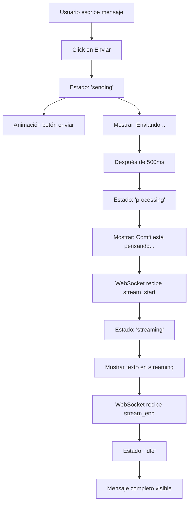

# 🎨 Mejoras UX/UI - Chat Widget Comfi

## 📋 Resumen Ejecutivo

Este documento presenta recomendaciones específicas de diseño UX/UI para resolver los problemas identificados en el chat widget de Comfi, enfocándose en mejorar el feedback visual, la jerarquía de información y la experiencia conversacional.

---

## 🎯 Problemas Identificados y Soluciones

### 1. ⏳ INDICADOR DE PROCESAMIENTO

**Problema**: Demora de 3-5 segundos sin feedback visual claro.

**Estado Actual**:
- Existe un indicador de "pensando" pero solo aparece cuando `isTyping` es true
- El indicador de "procesamiento" solo se muestra en condiciones específicas
- No hay transición suave entre estados

**Solución Propuesta**:

#### A. Indicador de Procesamiento Mejorado

```jsx
// Estado mejorado en ChatWidget.jsx
const [processingState, setProcessingState] = useState('idle') 
// Estados: 'idle', 'sending', 'processing', 'streaming'
```

#### B. Componente Visual de Procesamiento

```jsx
{/* Indicador de procesamiento inmediato */}
{processingState === 'sending' && (
  <div className="message bot">
    <div className="message-avatar">
      <ComfiAvatar size={28} className="comfi-avatar comfi-pulse" animated={true} />
    </div>
    <div className="message-bubble processing-immediate">
      <div className="processing-dots">
        <span></span>
        <span></span>
        <span></span>
      </div>
      <span className="processing-text">Enviando...</span>
    </div>
  </div>
)}

{processingState === 'processing' && (
  <div className="message bot">
    <div className="message-avatar">
      <ComfiAvatar size={28} className="comfi-avatar comfi-thinking" animated={true} />
    </div>
    <div className="message-bubble processing-thinking">
      <div className="thinking-animation">
        <div className="thinking-brain">🧠</div>
        <div className="thinking-dots">
          <span></span><span></span><span></span>
        </div>
      </div>
      <span className="processing-label">Comfi está pensando...</span>
    </div>
  </div>
)}
```

#### C. Flujo de Estados de Procesamiento

```
Usuario envía mensaje
    ↓ (inmediato, 0ms)
Estado: 'sending' → Muestra "Enviando..." con dots animados
    ↓ (después de 500ms)
Estado: 'processing' → Muestra "Comfi está pensando..." con animación cerebro
    ↓ (cuando llega stream_start)
Estado: 'streaming' → Muestra texto en streaming con cursor
    ↓ (cuando llega stream_end)
Estado: 'idle' → Mensaje completo
```

#### D. CSS para Indicador de Procesamiento

```css
/* Indicador inmediato de envío */
.message-bubble.processing-immediate {
  padding: 0.75rem 1.25rem;
  display: flex;
  align-items: center;
  gap: 0.75rem;
  background: white;
  border: 1px solid #e8e8e8;
}

.processing-dots span {
  width: 6px;
  height: 6px;
  border-radius: 50%;
  background: #ad37e0;
  display: inline-block;
  animation: processingBounce 1.4s infinite;
}

.processing-dots span:nth-child(2) { animation-delay: 0.2s; }
.processing-dots span:nth-child(3) { animation-delay: 0.4s; }

@keyframes processingBounce {
  0%, 60%, 100% { transform: translateY(0); opacity: 0.5; }
  30% { transform: translateY(-8px); opacity: 1; }
}

/* Indicador de pensamiento */
.message-bubble.processing-thinking {
  padding: 1rem 1.25rem;
  display: flex;
  align-items: center;
  gap: 1rem;
  background: linear-gradient(135deg, rgba(173, 55, 224, 0.08) 0%, rgba(173, 55, 224, 0.03) 100%);
  border: 1px solid rgba(173, 55, 224, 0.2);
}

.thinking-animation {
  display: flex;
  align-items: center;
  gap: 0.5rem;
}

.thinking-brain {
  font-size: 1.5rem;
  animation: thinkingPulse 1.5s ease-in-out infinite;
}

@keyframes thinkingPulse {
  0%, 100% { transform: scale(1); opacity: 0.8; }
  50% { transform: scale(1.2); opacity: 1; }
}

.thinking-dots {
  display: flex;
  gap: 0.25rem;
}

.thinking-dots span {
  width: 4px;
  height: 4px;
  border-radius: 50%;
  background: #ad37e0;
  animation: thinkingDots 1.4s infinite;
}

.thinking-dots span:nth-child(2) { animation-delay: 0.2s; }
.thinking-dots span:nth-child(3) { animation-delay: 0.4s; }

@keyframes thinkingDots {
  0%, 60%, 100% { transform: scale(1); opacity: 0.5; }
  30% { transform: scale(1.5); opacity: 1; }
}

.processing-label {
  font-size: 0.9rem;
  color: #ad37e0;
  font-weight: 500;
}
```

---

### 2. 📱 PRIMERA PANTALLA - LAYOUT SIN SCROLL

**Problema**: Los botones FAQ requieren scroll para verse completamente.

**Análisis del Problema**:
- Welcome section tiene: Logo (80px) + Título + Descripción + FAQ Quick Actions + 6 botones de acción rápida
- Total estimado: ~650px de contenido
- Altura disponible del chat: 680px - header (70px) - footer (120px) = ~490px
- **Resultado**: Overflow inevitable

**Solución Propuesta**:

#### A. Diseño Compacto y Priorizado

```jsx
<div className="welcome-section-compact">
  {/* Logo más pequeño */}
  <div className="welcome-logo-compact">
    <ComfiAvatar size={60} className="comfi-avatar comfi-wave" animated={true} />
  </div>
  
  {/* Título y descripción más compactos */}
  <h2 className="welcome-title">¡Hola! Soy Comfi 👋</h2>
  <p className="welcome-subtitle">¿En qué puedo ayudarte?</p>
  
  {/* FAQ Quick Actions - Solo 3 preguntas principales */}
  {showFAQQuickActions && (
    <FAQQuickActions
      quickFAQs={quickFAQs.slice(0, 3)} // Solo 3 FAQs
      onQuickFAQClick={handleQuickFAQClick}
      compact={true}
    />
  )}
  
  {/* Acciones rápidas - Grid 2x2 (solo 4 botones principales) */}
  <div className="quick-actions-grid-compact">
    {quickActions.slice(0, 4).map((action, index) => (
      <button key={index} className="quick-action-btn-compact" onClick={() => handleQuickAction(action.action)}>
        <span className="quick-action-icon">{action.icon}</span>
        <span className="quick-action-text">{action.text}</span>
      </button>
    ))}
  </div>
  
  {/* Botón "Ver más opciones" */}
  <button className="show-more-btn" onClick={() => setShowAllActions(true)}>
    Ver más opciones ↓
  </button>
</div>
```

#### B. CSS para Layout Compacto

```css
.welcome-section-compact {
  display: flex;
  flex-direction: column;
  align-items: center;
  text-align: center;
  padding: 1rem 1rem 0.5rem;
  gap: 0.75rem;
  animation: fadeInUp 0.6s ease;
}

.welcome-logo-compact {
  margin-bottom: 0.25rem;
}

.welcome-title {
  font-size: 1.35rem;
  font-weight: 700;
  color: #1a1a1a;
  margin: 0;
  line-height: 1.2;
}

.welcome-subtitle {
  color: #666;
  font-size: 0.9rem;
  margin: 0;
}

/* FAQ Quick Actions compacto */
.faq-quick-actions.compact {
  margin: 0.5rem 0;
  width: 100%;
}

.faq-quick-actions.compact .quick-actions-grid {
  grid-template-columns: 1fr; /* Una columna */
  gap: 0.5rem;
}

.faq-quick-actions.compact .quick-action-item {
  padding: 0.625rem 0.875rem;
  min-height: auto;
  font-size: 0.85rem;
}

/* Grid compacto 2x2 */
.quick-actions-grid-compact {
  display: grid;
  grid-template-columns: repeat(2, 1fr);
  gap: 0.5rem;
  width: 100%;
  max-width: 400px;
}

.quick-action-btn-compact {
  background: white;
  border: 2px solid #e8e8e8;
  border-radius: 12px;
  padding: 0.75rem;
  cursor: pointer;
  transition: all 0.3s ease;
  display: flex;
  flex-direction: column;
  align-items: center;
  gap: 0.25rem;
  min-height: 75px;
}

.quick-action-btn-compact:hover {
  border-color: #ad37e0;
  background: linear-gradient(135deg, rgba(173, 55, 224, 0.05) 0%, rgba(173, 55, 224, 0.02) 100%);
  transform: translateY(-2px);
  box-shadow: 0 6px 12px rgba(173, 55, 224, 0.15);
}

.quick-action-btn-compact .quick-action-icon {
  font-size: 1.5rem;
}

.quick-action-btn-compact .quick-action-text {
  font-size: 0.75rem;
  font-weight: 600;
  color: #333;
  line-height: 1.2;
}

/* Botón "Ver más" */
.show-more-btn {
  background: transparent;
  border: 1px dashed #d0d0d0;
  border-radius: 8px;
  padding: 0.5rem 1rem;
  color: #666;
  font-size: 0.85rem;
  cursor: pointer;
  transition: all 0.3s ease;
  margin-top: 0.25rem;
}

.show-more-btn:hover {
  border-color: #ad37e0;
  color: #ad37e0;
  background: rgba(173, 55, 224, 0.03);
}
```

#### C. Jerarquía Visual Optimizada

**Prioridad de Contenido**:
1. **Avatar + Saludo** (60px logo + 40px texto) = 100px
2. **3 FAQs principales** (3 × 45px) = 135px
3. **4 Acciones rápidas** (2 filas × 80px) = 160px
4. **Botón "Ver más"** = 40px
5. **Espaciado** = ~55px

**Total**: ~490px ✅ (cabe sin scroll)

---

### 3. 👤 AVATAR DEL USUARIO

**Problema**: Los mensajes del usuario no tienen avatar, solo aparece el de Comfi.

**Solución Propuesta**:

#### A. Avatar de Usuario con Personalización

```jsx
// Nuevo componente: UserAvatar.jsx
const UserAvatar = ({ size = 36, userName = 'Usuario', className = '' }) => {
  // Obtener iniciales del nombre
  const getInitials = (name) => {
    return name
      .split(' ')
      .map(word => word[0])
      .join('')
      .toUpperCase()
      .slice(0, 2)
  }

  // Generar color basado en el nombre (consistente)
  const getColorFromName = (name) => {
    const colors = [
      '#4a90e2', // Azul
      '#50c878', // Verde esmeralda
      '#ff6b6b', // Rojo coral
      '#ffa500', // Naranja
      '#9b59b6', // Púrpura
      '#3498db', // Azul cielo
    ]
    const index = name.charCodeAt(0) % colors.length
    return colors[index]
  }

  const initials = getInitials(userName)
  const bgColor = getColorFromName(userName)

  return (
    <div 
      className={`user-avatar-container ${className}`}
      style={{ 
        width: size, 
        height: size,
        background: `linear-gradient(135deg, ${bgColor} 0%, ${bgColor}dd 100%)`,
      }}
    >
      <span className="user-initials">{initials}</span>
    </div>
  )
}

export default UserAvatar
```

#### B. CSS para Avatar de Usuario

```css
/* UserAvatar.css */
.user-avatar-container {
  border-radius: 50%;
  display: flex;
  align-items: center;
  justify-content: center;
  flex-shrink: 0;
  box-shadow: 0 4px 12px rgba(0, 0, 0, 0.15);
  transition: transform 0.3s ease;
  position: relative;
  overflow: hidden;
}

.user-avatar-container::before {
  content: '';
  position: absolute;
  top: 0;
  left: 0;
  right: 0;
  bottom: 0;
  background: linear-gradient(135deg, rgba(255,255,255,0.2) 0%, transparent 100%);
  border-radius: 50%;
}

.user-avatar-container:hover {
  transform: scale(1.1);
}

.user-initials {
  font-size: 0.75em;
  font-weight: 700;
  color: white;
  text-shadow: 0 1px 2px rgba(0,0,0,0.2);
  z-index: 1;
  position: relative;
}

/* Animación de entrada */
.user-avatar-container {
  animation: avatarPop 0.4s cubic-bezier(0.34, 1.56, 0.64, 1);
}

@keyframes avatarPop {
  0% {
    transform: scale(0);
    opacity: 0;
  }
  100% {
    transform: scale(1);
    opacity: 1;
  }
}
```

#### C. Integración en ChatWidget

```jsx
// En ChatWidget.jsx
import UserAvatar from '../Logo/UserAvatar'

// En el render de mensajes
{msg.type === 'user' && (
  <div className="message-avatar user-avatar">
    <UserAvatar 
      size={36} 
      userName="Usuario" // Puede venir del contexto de autenticación
      className="user-avatar-animated"
    />
  </div>
)}
```

#### D. Variantes de Avatar de Usuario

**Opción 1: Iniciales con gradiente**
- Fondo: Gradiente de color basado en nombre
- Contenido: Iniciales del usuario (ej: "JD" para Juan Díaz)

**Opción 2: Emoji personalizado**
- Fondo: Color sólido
- Contenido: Emoji seleccionado por el usuario (👤 👨 👩 🧑)

**Opción 3: Foto de perfil**
- Si el usuario está autenticado, mostrar su foto
- Fallback a iniciales si no hay foto

---

### 4. 🎨 EXPERIENCIA GENERAL - MEJORAS CONVERSACIONALES

#### A. Microinteracciones Mejoradas

**1. Feedback al Enviar Mensaje**

```jsx
const handleSendMessage = (e) => {
  e?.preventDefault()
  if (inputValue.trim() || selectedImage) {
    // Animación de envío
    setProcessingState('sending')
    
    // Efecto visual en el botón de enviar
    const sendBtn = document.querySelector('.send-btn')
    sendBtn?.classList.add('sending-animation')
    
    sendTextMessage(inputValue)
    setInputValue('')
    setSelectedImage(null)
    
    // Limpiar animación después de 300ms
    setTimeout(() => {
      sendBtn?.classList.remove('sending-animation')
      setProcessingState('processing')
    }, 300)
  }
}
```

**CSS para animación de envío**:

```css
.send-btn.sending-animation {
  animation: sendPulse 0.3s ease-out;
}

@keyframes sendPulse {
  0% {
    transform: scale(1);
  }
  50% {
    transform: scale(0.85);
    box-shadow: 0 0 20px rgba(173, 55, 224, 0.6);
  }
  100% {
    transform: scale(1);
  }
}

/* Efecto de partículas al enviar */
.send-btn.sending-animation::after {
  content: '✨';
  position: absolute;
  font-size: 1.5rem;
  animation: particleFloat 0.6s ease-out forwards;
  pointer-events: none;
}

@keyframes particleFloat {
  0% {
    transform: translate(0, 0) scale(1);
    opacity: 1;
  }
  100% {
    transform: translate(20px, -30px) scale(0);
    opacity: 0;
  }
}
```

**2. Transiciones Suaves entre Estados**

```css
/* Transición suave al cambiar de estado */
.message-bubble {
  transition: all 0.3s cubic-bezier(0.4, 0, 0.2, 1);
}

.message-bubble.processing-immediate {
  animation: fadeInScale 0.3s ease-out;
}

.message-bubble.processing-thinking {
  animation: fadeInScale 0.3s ease-out 0.2s backwards;
}

@keyframes fadeInScale {
  0% {
    opacity: 0;
    transform: scale(0.9) translateY(10px);
  }
  100% {
    opacity: 1;
    transform: scale(1) translateY(0);
  }
}
```

#### B. Estados Visuales Claros

**1. Indicador de Conexión Mejorado**

```jsx
<div className="chat-header-info">
  <h3>Comfi</h3>
  <div className={`status-badge ${isConnected ? 'online' : 'offline'}`}>
    <span className="status-dot"></span>
    <span className="status-text">
      {isConnected ? 'En línea' : 'Reconectando...'}
    </span>
  </div>
</div>
```

```css
.status-badge {
  display: flex;
  align-items: center;
  gap: 0.5rem;
  padding: 0.25rem 0.75rem;
  border-radius: 12px;
  font-size: 0.75rem;
  font-weight: 600;
  transition: all 0.3s ease;
}

.status-badge.online {
  background: rgba(76, 175, 80, 0.15);
  color: #4caf50;
}

.status-badge.offline {
  background: rgba(244, 67, 54, 0.15);
  color: #f44336;
  animation: reconnectPulse 1.5s ease-in-out infinite;
}

.status-dot {
  width: 8px;
  height: 8px;
  border-radius: 50%;
  background: currentColor;
}

.status-badge.online .status-dot {
  animation: statusPulse 2s ease-in-out infinite;
}

@keyframes statusPulse {
  0%, 100% { opacity: 1; transform: scale(1); }
  50% { opacity: 0.6; transform: scale(1.2); }
}

@keyframes reconnectPulse {
  0%, 100% { opacity: 1; }
  50% { opacity: 0.5; }
}
```

**2. Indicador de Escritura del Usuario**

```jsx
// Mostrar cuando el usuario está escribiendo
{inputValue.length > 0 && (
  <div className="user-typing-indicator">
    <span className="typing-icon">✍️</span>
    <span className="typing-label">Escribiendo...</span>
  </div>
)}
```

```css
.user-typing-indicator {
  position: absolute;
  bottom: 100%;
  right: 1rem;
  background: white;
  padding: 0.5rem 1rem;
  border-radius: 12px 12px 0 0;
  box-shadow: 0 -2px 8px rgba(0, 0, 0, 0.1);
  display: flex;
  align-items: center;
  gap: 0.5rem;
  font-size: 0.85rem;
  color: #666;
  animation: slideUp 0.3s ease-out;
}

@keyframes slideUp {
  from {
    transform: translateY(10px);
    opacity: 0;
  }
  to {
    transform: translateY(0);
    opacity: 1;
  }
}
```

#### C. Mejoras en Respuestas Visuales

**1. Mensajes con Acciones Rápidas**

```jsx
// Componente para respuestas con botones de acción
const MessageWithActions = ({ message, actions }) => (
  <div className="message-with-actions">
    <div className="message-content">{message}</div>
    <div className="message-actions">
      {actions.map((action, index) => (
        <button 
          key={index}
          className="message-action-btn"
          onClick={action.onClick}
        >
          {action.icon && <span className="action-icon">{action.icon}</span>}
          <span className="action-text">{action.text}</span>
        </button>
      ))}
    </div>
  </div>
)

// Ejemplo de uso
{msg.type === 'bot' && msg.actions && (
  <MessageWithActions 
    message={msg.content}
    actions={[
      { icon: '💰', text: 'Ver saldo', onClick: () => handleAction('balance') },
      { icon: '💸', text: 'Transferir', onClick: () => handleAction('transfer') }
    ]}
  />
)}
```

```css
.message-with-actions {
  display: flex;
  flex-direction: column;
  gap: 0.75rem;
}

.message-actions {
  display: flex;
  flex-wrap: wrap;
  gap: 0.5rem;
}

.message-action-btn {
  background: white;
  border: 2px solid #e8e8e8;
  border-radius: 20px;
  padding: 0.5rem 1rem;
  font-size: 0.85rem;
  font-weight: 600;
  color: #333;
  cursor: pointer;
  transition: all 0.3s ease;
  display: flex;
  align-items: center;
  gap: 0.5rem;
}

.message-action-btn:hover {
  border-color: #ad37e0;
  background: linear-gradient(135deg, rgba(173, 55, 224, 0.05) 0%, rgba(173, 55, 224, 0.02) 100%);
  transform: translateY(-2px);
  box-shadow: 0 4px 8px rgba(173, 55, 224, 0.15);
}

.message-action-btn .action-icon {
  font-size: 1.1rem;
}
```

**2. Confirmaciones Visuales**

```jsx
// Componente de confirmación
const ConfirmationMessage = ({ type, title, details, onConfirm, onCancel }) => (
  <div className={`confirmation-card ${type}`}>
    <div className="confirmation-icon">
      {type === 'success' && '✅'}
      {type === 'warning' && '⚠️'}
      {type === 'info' && 'ℹ️'}
    </div>
    <div className="confirmation-content">
      <h4 className="confirmation-title">{title}</h4>
      {details && <p className="confirmation-details">{details}</p>}
    </div>
    {(onConfirm || onCancel) && (
      <div className="confirmation-actions">
        {onCancel && (
          <button className="btn-cancel" onClick={onCancel}>
            Cancelar
          </button>
        )}
        {onConfirm && (
          <button className="btn-confirm" onClick={onConfirm}>
            Confirmar
          </button>
        )}
      </div>
    )}
  </div>
)
```

```css
.confirmation-card {
  background: white;
  border-radius: 12px;
  padding: 1rem;
  display: flex;
  flex-direction: column;
  gap: 0.75rem;
  border-left: 4px solid;
  box-shadow: 0 4px 12px rgba(0, 0, 0, 0.1);
  animation: slideInRight 0.4s ease-out;
}

.confirmation-card.success { border-color: #4caf50; }
.confirmation-card.warning { border-color: #ff9800; }
.confirmation-card.info { border-color: #2196f3; }

.confirmation-icon {
  font-size: 2rem;
  text-align: center;
}

.confirmation-title {
  font-size: 1rem;
  font-weight: 700;
  color: #1a1a1a;
  margin: 0;
}

.confirmation-details {
  font-size: 0.9rem;
  color: #666;
  margin: 0;
}

.confirmation-actions {
  display: flex;
  gap: 0.5rem;
  margin-top: 0.5rem;
}

.btn-cancel, .btn-confirm {
  flex: 1;
  padding: 0.625rem 1rem;
  border-radius: 8px;
  font-weight: 600;
  font-size: 0.9rem;
  cursor: pointer;
  transition: all 0.3s ease;
}

.btn-cancel {
  background: white;
  border: 2px solid #e8e8e8;
  color: #666;
}

.btn-cancel:hover {
  border-color: #d0d0d0;
  background: #f5f5f5;
}

.btn-confirm {
  background: linear-gradient(135deg, #ad37e0 0%, #8b2bb3 100%);
  border: none;
  color: white;
  box-shadow: 0 4px 12px rgba(173, 55, 224, 0.3);
}

.btn-confirm:hover {
  transform: translateY(-2px);
  box-shadow: 0 6px 16px rgba(173, 55, 224, 0.4);
}

@keyframes slideInRight {
  from {
    transform: translateX(20px);
    opacity: 0;
  }
  to {
    transform: translateX(0);
    opacity: 1;
  }
}
```

---

## 📊 Flujo de Estados Mejorado



---

## 🎯 Priorización de Implementación

### Fase 1: Crítico (Implementar primero)
1. ✅ **Indicador de procesamiento inmediato** - Resuelve el problema principal
2. ✅ **Layout compacto sin scroll** - Mejora la primera impresión
3. ✅ **Avatar de usuario** - Completa la experiencia conversacional

### Fase 2: Importante (Implementar después)
4. 🎨 **Microinteracciones mejoradas** - Pulir la experiencia
5. 🎨 **Estados visuales claros** - Mejorar feedback
6. 🎨 **Mensajes con acciones** - Aumentar interactividad

### Fase 3: Mejoras adicionales (Opcional)
7. 💎 **Confirmaciones visuales** - Para transacciones
8. 💎 **Animaciones avanzadas** - Delight moments
9. 💎 **Temas personalizables** - Personalización

---

## 📱 Consideraciones Responsive

### Mobile (< 768px)

```css
@media (max-width: 768px) {
  /* Layout compacto aún más reducido */
  .welcome-section-compact {
    padding: 0.75rem 0.75rem 0.5rem;
    gap: 0.5rem;
  }
  
  .welcome-logo-compact {
    margin-bottom: 0;
  }
  
  .welcome-title {
    font-size: 1.25rem;
  }
  
  .welcome-subtitle {
    font-size: 0.85rem;
  }
  
  /* FAQ en una sola columna */
  .faq-quick-actions.compact .quick-actions-grid {
    grid-template-columns: 1fr;
  }
  
  /* Botones de acción más pequeños */
  .quick-action-btn-compact {
    padding: 0.625rem;
    min-height: 65px;
  }
  
  .quick-action-btn-compact .quick-action-icon {
    font-size: 1.25rem;
  }
  
  .quick-action-btn-compact .quick-action-text {
    font-size: 0.7rem;
  }
  
  /* Avatares más pequeños */
  .message-avatar {
    width: 32px;
    height: 32px;
  }
  
  /* Burbujas de mensaje más anchas */
  .message-bubble {
    max-width: 85%;
    font-size: 0.9rem;
  }
}
```

---

## 🎨 Guía de Estilo Conversacional

### Tono y Lenguaje

**✅ Hacer**:
- Usar lenguaje natural y cercano
- Confirmar acciones importantes
- Proporcionar feedback inmediato
- Usar emojis con moderación (💰 💳 📊 ✅)

**❌ Evitar**:
- Jerga técnica innecesaria
- Mensajes muy largos
- Múltiples preguntas simultáneas
- Emojis excesivos

### Ejemplos de Mensajes

**Procesamiento**:
- ✅ "Comfi está pensando..."
- ✅ "Procesando tu solicitud..."
- ❌ "Esperando respuesta del servidor..."

**Confirmaciones**:
- ✅ "¡Listo! Tu transferencia se realizó con éxito 💰"
- ✅ "Perfecto, encontré 3 productos que te pueden interesar"
- ❌ "Operación completada exitosamente"

**Errores**:
- ✅ "Ups, algo salió mal. ¿Puedes intentar de nuevo?"
- ✅ "No pude procesar eso. ¿Me lo explicas de otra forma?"
- ❌ "Error 500: Internal Server Error"

---

## 🔧 Implementación Técnica

### Cambios en ChatWidget.jsx

```jsx
// 1. Agregar estado de procesamiento
const [processingState, setProcessingState] = useState('idle')

// 2. Modificar handleSendMessage
const handleSendMessage = (e) => {
  e?.preventDefault()
  if (inputValue.trim() || selectedImage) {
    // Cambiar a estado 'sending' inmediatamente
    setProcessingState('sending')
    
    // Animación del botón
    const sendBtn = document.querySelector('.send-btn')
    sendBtn?.classList.add('sending-animation')
    
    // Enviar mensaje
    sendTextMessage(inputValue)
    setInputValue('')
    setSelectedImage(null)
    
    // Después de 300ms, cambiar a 'processing'
    setTimeout(() => {
      sendBtn?.classList.remove('sending-animation')
      setProcessingState('processing')
    }, 300)
    
    // Después de 500ms adicionales, si no hay respuesta, mantener 'processing'
    setTimeout(() => {
      if (processingState !== 'streaming') {
        setProcessingState('processing')
      }
    }, 800)
  }
}

// 3. Actualizar cuando llega el stream
useEffect(() => {
  if (isStreaming) {
    setProcessingState('streaming')
  } else if (processingState === 'streaming') {
    setProcessingState('idle')
  }
}, [isStreaming])
```

### Cambios en WebSocketContext.jsx

```jsx
// Agregar callback para notificar cambios de estado
const [connectionState, setConnectionState] = useState('connecting')
// Estados: 'connecting', 'connected', 'disconnected', 'reconnecting'

// En onopen
wsRef.current.onopen = () => {
  console.log('✅ WebSocket connected')
  setIsConnected(true)
  setConnectionState('connected')
  reconnectAttemptsRef.current = 0
  // ...
}

// En onclose
wsRef.current.onclose = () => {
  console.log('🔌 WebSocket disconnected')
  setIsConnected(false)
  setConnectionState('reconnecting')
  // ...
}
```

### Nuevos Componentes a Crear

1. **UserAvatar.jsx** - Avatar personalizado del usuario
2. **ProcessingIndicator.jsx** - Indicador de procesamiento reutilizable
3. **MessageWithActions.jsx** - Mensajes con botones de acción
4. **ConfirmationMessage.jsx** - Tarjetas de confirmación

---

## 📐 Especificaciones de Diseño

### Colores

```css
:root {
  /* Primarios */
  --comfi-primary: #ad37e0;
  --comfi-primary-dark: #8b2bb3;
  --comfi-primary-light: rgba(173, 55, 224, 0.1);
  
  /* Estados */
  --success: #4caf50;
  --warning: #ff9800;
  --error: #f44336;
  --info: #2196f3;
  
  /* Neutrales */
  --text-primary: #1a1a1a;
  --text-secondary: #666;
  --border: #e8e8e8;
  --background: #f5f5f7;
  
  /* Avatares */
  --avatar-blue: #4a90e2;
  --avatar-green: #50c878;
  --avatar-coral: #ff6b6b;
  --avatar-orange: #ffa500;
  --avatar-purple: #9b59b6;
}
```

### Espaciado

```css
:root {
  --space-xs: 0.25rem;   /* 4px */
  --space-sm: 0.5rem;    /* 8px */
  --space-md: 0.75rem;   /* 12px */
  --space-lg: 1rem;      /* 16px */
  --space-xl: 1.5rem;    /* 24px */
  --space-2xl: 2rem;     /* 32px */
}
```

### Tipografía

```css
:root {
  --font-xs: 0.75rem;    /* 12px */
  --font-sm: 0.85rem;    /* 13.6px */
  --font-md: 0.95rem;    /* 15.2px */
  --font-lg: 1.1rem;     /* 17.6px */
  --font-xl: 1.35rem;    /* 21.6px */
  --font-2xl: 1.5rem;    /* 24px */
}
```

### Sombras

```css
:root {
  --shadow-sm: 0 2px 8px rgba(0, 0, 0, 0.06);
  --shadow-md: 0 4px 12px rgba(0, 0, 0, 0.1);
  --shadow-lg: 0 6px 20px rgba(0, 0, 0, 0.15);
  --shadow-primary: 0 4px 12px rgba(173, 55, 224, 0.3);
}
```

### Animaciones

```css
:root {
  --transition-fast: 0.2s ease;
  --transition-normal: 0.3s ease;
  --transition-slow: 0.5s ease;
  --easing-bounce: cubic-bezier(0.34, 1.56, 0.64, 1);
  --easing-smooth: cubic-bezier(0.4, 0, 0.2, 1);
}
```

---

## ✅ Checklist de Implementación

### Fase 1: Indicador de Procesamiento
- [ ] Agregar estado `processingState` en ChatWidget
- [ ] Crear componente `ProcessingIndicator.jsx`
- [ ] Implementar animación "Enviando..."
- [ ] Implementar animación "Comfi está pensando..."
- [ ] Agregar CSS para indicadores
- [ ] Conectar con estados de WebSocket
- [ ] Probar transiciones entre estados

### Fase 2: Layout Compacto
- [ ] Reducir tamaño del logo (80px → 60px)
- [ ] Compactar título y descripción
- [ ] Limitar FAQs a 3 elementos
- [ ] Reducir acciones rápidas a 4 (2x2)
- [ ] Agregar botón "Ver más opciones"
- [ ] Ajustar espaciado y padding
- [ ] Verificar que no requiere scroll
- [ ] Probar en diferentes resoluciones

### Fase 3: Avatar de Usuario
- [ ] Crear componente `UserAvatar.jsx`
- [ ] Implementar generación de iniciales
- [ ] Implementar colores basados en nombre
- [ ] Agregar CSS para avatar
- [ ] Integrar en ChatWidget
- [ ] Agregar animaciones de entrada
- [ ] Probar con diferentes nombres

### Fase 4: Microinteracciones
- [ ] Animación de envío en botón
- [ ] Efecto de partículas al enviar
- [ ] Transiciones suaves entre estados
- [ ] Hover effects mejorados
- [ ] Animaciones de entrada de mensajes

### Fase 5: Testing
- [ ] Probar flujo completo de envío
- [ ] Verificar indicadores en diferentes escenarios
- [ ] Probar responsive (mobile/tablet/desktop)
- [ ] Verificar accesibilidad
- [ ] Probar con lectores de pantalla
- [ ] Validar performance de animaciones

---

## 🎬 Mockups de Flujo

### Flujo 1: Envío de Mensaje

```
┌─────────────────────────────────────┐
│ [Comfi Avatar] Comfi      [En línea]│
│                                  [×] │
├─────────────────────────────────────┤
│                                     │
│  ┌─────────────────────────────┐   │
│  │ 👤 Usuario                  │   │
│  │ ┌─────────────────────────┐ │   │
│  │ │ ¿Cuál es mi saldo?      │ │   │
│  │ └─────────────────────────┘ │   │
│  └─────────────────────────────┘   │
│                                     │
│  ┌─────────────────────────────┐   │
│  │ [Comfi] 🧠 • • •            │   │
│  │ ┌─────────────────────────┐ │   │
│  │ │ Comfi está pensando...  │ │   │
│  │ └─────────────────────────┘ │   │
│  └─────────────────────────────┘   │
│                                     │
├─────────────────────────────────────┤
│ 📷 🎤 [Escribe tu mensaje...] [➤]  │
└─────────────────────────────────────┘
```

### Flujo 2: Respuesta con Streaming

```
┌─────────────────────────────────────┐
│ [Comfi Avatar] Comfi      [En línea]│
│                                  [×] │
├─────────────────────────────────────┤
│                                     │
│  ┌─────────────────────────────┐   │
│  │ [Comfi] 💬                  │   │
│  │ ┌─────────────────────────┐ │   │
│  │ │ Tu saldo actual es      │ │   │
│  │ │ $15,234.50 MXN|         │ │   │
│  │ └─────────────────────────┘ │   │
│  └─────────────────────────────┘   │
│                                     │
├─────────────────────────────────────┤
│ 📷 🎤 [Escribe tu mensaje...] [➤]  │
└─────────────────────────────────────┘
```

### Flujo 3: Pantalla de Bienvenida Compacta

```
┌─────────────────────────────────────┐
│ [Comfi Avatar] Comfi      [En línea]│
│                                  [×] │
├─────────────────────────────────────┤
│                                     │
│         [Comfi Avatar 60px]         │
│                                     │
│      ¡Hola! Soy Comfi 👋           │
│      ¿En qué puedo ayudarte?       │
│                                     │
│  ⚡ Preguntas frecuentes            │
│  ┌─────────────────────────────┐   │
│  │ 🏦 ¿Cómo me afilio?         │   │
│  │ 💳 Tipos de crédito         │   │
│  │ 🎁 Subsidios disponibles    │   │
│  └─────────────────────────────┘   │
│                                     │
│  ┌──────────┬──────────┐           │
│  │ 💰 Ver   │ 💸 Hacer │           │
│  │ saldo    │ transfer │           │
│  ├──────────┼──────────┤           │
│  │ 🛒 Ver   │ 📊 Mis   │           │
│  │ product  │ transacc │           │
│  └──────────┴──────────┘           │
│                                     │
│  [Ver más opciones ↓]              │
│                                     │
├─────────────────────────────────────┤
│ 📷 🎤 [Escribe tu mensaje...] [➤]  │
└─────────────────────────────────────┘
```

---

## 📚 Referencias y Recursos

### Inspiración de Diseño
- **Intercom**: Indicadores de procesamiento y typing
- **Drift**: Animaciones suaves y microinteracciones
- **WhatsApp Web**: Layout de mensajes y avatares
- **Slack**: Estados de conexión y feedback visual

### Bibliotecas Útiles
- **Framer Motion**: Animaciones avanzadas (opcional)
- **React Spring**: Animaciones fluidas (opcional)
- **Lottie**: Animaciones JSON (para indicadores complejos)

### Herramientas de Testing
- **Lighthouse**: Performance y accesibilidad
- **axe DevTools**: Validación de accesibilidad
- **BrowserStack**: Testing cross-browser
- **Chrome DevTools**: Debugging de animaciones

---

## 🎓 Mejores Prácticas

### Accesibilidad
1. ✅ Usar `aria-live` para anuncios de estado
2. ✅ Proporcionar alternativas textuales para emojis
3. ✅ Mantener contraste mínimo 4.5:1
4. ✅ Soporte completo de teclado
5. ✅ Focus visible en todos los elementos interactivos

### Performance
1. ✅ Usar `will-change` para animaciones
2. ✅ Limitar animaciones simultáneas
3. ✅ Optimizar re-renders con React.memo
4. ✅ Lazy load de componentes pesados
5. ✅ Debounce en inputs de búsqueda

### UX
1. ✅ Feedback inmediato (<100ms)
2. ✅ Confirmaciones para acciones destructivas
3. ✅ Estados de carga claros
4. ✅ Mensajes de error accionables
5. ✅ Navegación intuitiva

---

## 📞 Próximos Pasos

1. **Revisar y aprobar** este documento con el equipo
2. **Priorizar** las mejoras según impacto y esfuerzo
3. **Crear tickets** en el sistema de gestión de proyectos
4. **Implementar Fase 1** (crítico)
5. **Testing y ajustes** basados en feedback
6. **Implementar Fases 2-3** progresivamente
7. **Monitorear métricas** de engagement y satisfacción

---

**Documento creado por**: Kiro - Diseñador UX/UI especializado en interfaces conversacionales
**Fecha**: 2024
**Versión**: 1.0
